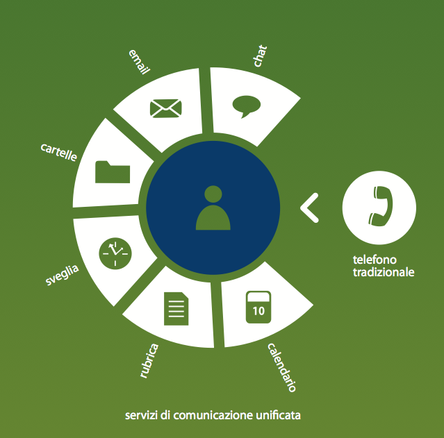

============
Introduzione
============
|product| è una nuova soluzione telefonica aperta ed integrata con l'intero sistema informativo aziendale, in grado di fornire tutti i servizi di comunicazione e collaborazione: dati, voce e video.

Il cuore OpenSource di |product| è basato principalmente su due progetti `Asterisk <http://www.asterisk.org/>`_ e `FreePBX <http://www.freepbx.org/>`_ potenziati grazie allo sviluppo di innumerevoli moduli e funzioni per semplificarne l’utilizzo e permetterne una forte integrazione con i dati presenti in azienda, pur mantenendo la caratteristica di apertura volta a consentirne la massima flessibilità a chiunque intenda sviluppare le proprie integrazioni usando i linguaggi di programmazione più comuni.

|product| concentra in un’unica soluzione, adattabile alle varie esigenze aziendali, le funzionalità del centralino tradizionale (PBX) con le più innovative peculiarità dei sistemi telefonici avanzati. I vantaggi di tale sistema consistono in una sensibile riduzione dei costi di gestione e manutenzione, e nella scalabilità dell’architettura IP che è adattabile alle eventuali evoluzioni strutturali dell’azienda.

Componenti e connessioni
========================
|product| integra un centralino tradizionale, con la tecnologia VOIP, linee ISDN e/o linee Analogiche e/o Flussi primari ed un sistema linux di tipo enterprise quale |parent_product|. |product| non è altro che uno dei tanti moduli che è possibile installare su |parent_product| di cui può sfruttare tutte le componenti e potenzialità. |parent_product|, derivato da RedHat Enterprise e Centos, ha tra i servizi installati 

* Apache
* Php
* Mysql 

che vengono utilizzati dal modulo |product|. Le componenti prettamente telefoniche invece sono:

* Basato su Asterisk
* Schede per connessione con Fonia Pubblica (PSTN): Digium
* Tutti i Codec disponibili
* Tutti i Protocolli disponibili, utilizzati di default SIP e IAX 

|product| può interagire

* con il gestore telefonico che fornisce le linee ISDN o Analogiche o l'accesso primario
* con telefoni analogici (tramite ATA)
* con un box GSM, per telefonate per cellulari
* con la rete aziendale (pc, telefoni IP wifi e dect)
* con internet, tramite il router/firewall
* con utenti mobili, via notebook con Softphone
* con sedi remote, con altro |product| 

Funzioni Principali
===================

* Funzioni Telefoniche: trasferta, inoltro, deviazione, gruppi di chiamata, parcheggio, risposta x assente, gestione ID chiamante/chiamato
* Gestione avanzata dell'inoltro delle chiamate (CID, CLIP)
* Segreteria telefonica/Voicemail: interfaccia web, integrazione con posta elettronica, personalizzazione messaggio
* Funzioni Messaggistica giorno/notte/festivo/pausa personalizzabili e flessibili
* Risponditore telefonico multilivello programmabile ( IVR)
* Annunci vocali personalizzati, sistema basato su mp3 e wav
* Autocompletamento del CallerID sulla rubrica
* Gestione CODE di CallCenter o Contact Center
* Gestione LCR ( Instradamento delle chiamate verso l'operatore più economico per tipo di chiamata - incluso instradamento verso schede GSM)
* Registrazione dettagli chiamata (CDR) 

Funzioni Evolute
================

* Possibilità di integrazione con fax server (inoltro automatico via email - vedi paragrafo successivo)
* Funzioni di AudioVideoConferenza con 'Aule Virtuali'
* Interfacciamento con software aziendali (es. CRM, ERP, Outlook, ecc..)
* Possibilità di sviluppo di nuove funzionalità con minimo sforzo grazie alla piattaforma aperta su cui si basa il sistema Funzionalità complete VoIP (voice over IP), interfacciabile con standard VOIP
* Servizi di autenticazione (accesso a servizi tramite password e codici di sicurezza)
* Supporto di tele manutenzione per ridurre al minimo la necessità di interventi presso sede cliente
* Possibilità di integrare GSM BOX
* |product_cti|
* Server Fax
