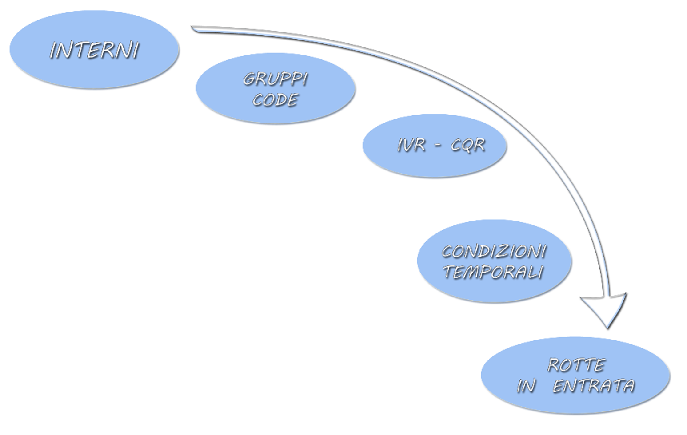

===================
Configurazione Base
===================

.. _accesso_ref_label:

Accesso
=======

Il pannello di configurazione di |product| è raggiungibile all'indirizzo

https://nomeserver/|product_command|

dove per *nomeserver* si intende il nome (anche seguito dal dominio) dato al |product| in fase di installazione.

L'accesso è consentito anche sostituendo a *nomeserver* l'ip del |product|.

L'accesso è garantito di default all'utente admin che viene configurato durante l'installazione.

E' possibile poi accedere anche con altri utenti a patto che questi siano membri del gruppo **voicemanagers** e che siano stati abilitati tramite il modulo :ref:`Amministratori <amministratori_ref_label>`.

.. _applica_ref_label:

Applica Cambiamenti
===================

Tutte le configurazioni di |product| vengono salvate in un database MySQL, ogni volta che viene fatto un cambiamento alla configurazione di |product| compare il tasto "Applica Cambiamenti".

Premendo questo pulsante le configurazioni salvate sul database vengono applicate ai files di configurazione di |product| attivandole, una configurazione effettuata senza avere premuto il pulsante "Applica Cambiamenti" rimarrà non attiva, quindi ad esempio se creo un interno senza Applica Cambiamenti non riuscirò a registrare un qualsiasi telefono. 

.. _rete_ref_label:

Rete
====

Configurazione di Rete 
----------------------

Il |product|, essendo un centralino Voip, svolge le tutte le sue funzionalità via rete.

Tramite la rete comunica con gli apparecchi telefonici, con i gateway delle risorse telefoniche (Sangoma, Patton, Portech, Provider Voip...), tramite la rete si aggiorna e comunica al Centro Servizi il suo stato di funzionamento.

|product| non ha necessità di avere una rete dedicata alle comunicazioni Voip in praticamente nessun caso, può essere consigliata solo in caso di traffico elevatissimo e di switch non in grado di gestirlo insieme a tutto il resto.

Il |product|, quindi, può essere inserito tranquillamente in una rete preesistente insieme a tutti gli apparecchi e gateway telefonici.

|product| essendo un server a tutti gli effetti ha bisogno di un ip statico sulla sua interfaccia di rete.

Configurazione di Rete Gateway Telefonici e Telefoni
----------------------------------------------------

I gateway telefonici vanno preferibilmente configurati con un ip statico fuori da un eventuale range dhcp.

Questo li preserva da eventuali problemi di malfunzionamento del servizio dhcp e da possibili conflitti di indirizzo ip, in quanto se ci fossero minerebbero il funzionamento sostanziale del |product| essendo i gestori delle sorgenti telefoniche.

I telefoni, invece, non hanno necessità pratiche di un indirizzo statico, anzi lasciarli in dhcp permette di utilizzare appieno il :ref:`Provisioning <provisioning_ref_label>`.

Se, nonostante tutto, si ha l'esigenza di avere i telefoni con ip fisso, consigliamo di lasciarli in dhcp e configurare degli assegnamenti statici; è anche possibile con i telefoni in dhcp, configurare con il :ref:`Provisioning <provisioning_ref_label>` che prendano ip statici a configurazione ultimata, non è, però, una soluzione molto comoda perché richiede molto lavoro per ogni telefono.

.. _funzionalita_base_ref_label:

Funzionalità Base
=================

Introduzione
------------

Attraverso la pagina principale di |product| è possibile accedere al manuale del centralino, tale documentazione riporta tutti i codici per accedere alle funzioni del centralino direttamente dalla tastiera telefonica.

Tutti i comandi di seguito elencati si riferiscono al codice di default di |product|, per cambiarlo o per maggiori informazioni vedi i :ref:`Codici Servizi <codici_servizi_ref_label>`.

Trasferimento Chiamate (cieco e consultativo)
---------------------------------------------

|product| supporta il trasferimento cieco e consultativo delle chiamate. Per effettuare il Trasferimento Consultativo della chiamata occorre digitare: ::

  # + numero interno

parlare con l'interno, successivamente chiudere il ricevitore per passare la chiamata o attendere che l'interno chiamato chiuda il ricevitore per riprendere la chiamata.

Per effettuare il Trasferimento Cieco della chiamata occorre semplicemente effettuare un Trasferimento Consultativo senza parlare con l'interno, questo per non perdere delle funzionalità avanzate come ad esempio il ritorno in caso di mancata risposta. Esiste anche un codice per il trasferimento blindato(sconsigliato): ::

  *2 + numero interno

.. note::   Quando possibile consigliamo sempre di utilizzare le funzionalità di trasferimento dei telefoni ip e non quelle del centralino.

.. note::   Con questo sistema, di default si possono trasferire solo le chiamate ricevute. Per trasferire chiamate fatte occorre abilitarle :ref:`Impostazioni Generali <impostazioni_generali_ref_label>`.
   La sequenza di tasti indicata può essere variata all'interno del menu :ref:`Codici Servizi <codici_servizi_ref_label>` dell'interfaccia web.

.. note::   Il metodo appena descritto vale per tutti i telefoni IP, indipendentemente da marca e modello. Oltre a questo metodo ogni telefono ha a disposizione un pulsante di trasferimento. Per il trasferimento delle chiamate usando i pulsanti specifici disponibili nei vari telefoni rimandiamo alla documentazione specifica del telefono.

Parcheggio Chiamate
-------------------

Per parcheggiare le chiamate in una delle 9 posizioni che vanno dal numero 71 al 79 è sufficiente trasferire la chiamata all'interno speciale 70. A seguito del trasferimento sarà comunicata la posizione in cui è stata parcheggiata la chiamata. Dopo un timeout configurabile la chiamata sarà instradata alla destinazione scelta. Il parcheggio di default non è attivato, per maggiori informazioni vedi :ref:`Parcheggi <parcheggi_ref_label>`. ::

  trasferire la chiamata all'interno 70 per parcheggiare la chiamata
  *85    intercetta qualsiasi chiamata Parcheggiata

Non Disturbare
--------------

Il non disturbare rende non raggiungibile un interno del centralino. Si può attivare lato centralino con i seguenti comandi di default ::

  *78    Abilita DND (Non disturbare)
  *79    Disabilita DND (Non disturbare)

oppure utilizzando le funzionalità dei telefoni che lo supportano.

.. note::   Consigliamo sempre di utilizzare il DND del centralino e non dei telefoni, se viene utilizzato quello dei telefoni se ne perde la visibilità sugli strumenti che la monitorano come ad esempio il |product_cti|

Avviso di Chiamata
------------------

L'avviso di chiamata se attivo consente ad un interno di ricevere telefonate a lui destinate nonostante sia impegnato in una conversazione. Di default è attivo sugli interni appena creati. I codici di attivazione sono: ::

  *70    Abilita Avviso di Chiamata, possibilità di ricevere più di una chiamata sull'interno
  *71    Disabilita Avviso di Chiamata

Gestione Casella Vocale
-----------------------

La casella vocale può essere gestita da un interno del centralino. Di default la casella vocale è disabilitata quindi deve essere attivata nelle proprietà dell'interno vedi :ref:`qui <casella_vocale_ref_label>`. Accedendo alla casella vocale da un interno, il proprio o no, verrà sempre chiesto l'inserimento della propria password. ::

  *98    Accedi alla Casella Vocale (viene chiesto su quale Casella)
  *98XXX Accedi alla Casella Vocale per la casella XXX
  *97    Accedi alla propria Casella Vocale (relativa al telefono da cui si digita il codice)

Deviazione di Chiamata
----------------------

La deviazione di chiamata dirotta la chiamata destinata ad un interno verso un'altra destinazione in determinate condizioni. Può essere attivato in ogni situazione o ad esempio in caso di interno occupato o nessuna risposta. Per attivare la deviazione ad una casella vocale basta utilizzare un \* davanti all'interno, ad esempio per attivare la deviazione di chiamata alla casella vocale dell'interno 205 basta chiamare \*72\*205 ::

  *72    Abilita deviazione di chiamata (vengono chiesti i dettagli)
  *72XXXXX   Abilita deviazione di Chiamata sul numero XXXXX
  *73    Disabilita deviazione di chiamata
  *90    Abilita deviazione di Chiamata su Occupato (vengono chiesti i dettagli)
  *90XXXXX   Abilita deviazione di Chiamata su Occupato sul numero XXXXX
  *91    Disabilita deviazione di chiamata su Occupato
  *52    Abilita deviazione di Chiamata su Nessuna Risposta
  *53    Disabilita deviazione di Chiamata su Nessuna Risposta

.. note:: Consigliamo sempre di utilizzare la deviazione di chiamata del centralino e non dei telefoni, se viene utilizzato quello dei telefoni se ne perde la visibilità sugli strumenti che la monitorano come ad esempio il |product_cti|

.. note:: Per effettuare la Deviazione di Chiamata su Numeri esterni ricordarsi di inserire l'eventuale codice di uscita (es: se per utilizzare un certo fascio occorre digitare lo 0, per attivare la deviazione di chiamata su un numero esterno 0721405516 occorre digitare: \*7200721405516).

Risposta per Assente
--------------------

La risposta per assente o Pickup consente di intercettare una chiamata che sta **suonando** su un altro interno. |product| gestisce questa funzionalità in due modi: con il Pickup generale o con quello diretto.

Pickup Generale
~~~~~~~~~~~~~~~

Il pickup generale di |product| consente di intercettare una chiamata che sta suonando su un interno che abbia configurato nel parametro callgroup un valore uguale al pickupgroup dell'interno che usa il pickup, per maggiori informazioni vedi :ref:`qui <interni_sip_callgroup_ref_label>` e :ref:`qui <interni_sip_pickupgroup_ref_label>`. ::

  *8 Intercetta la chiamata su un interno appartenente al proprio gruppo (pickupgroup)

Questa è la metodologia consigliata per fare pickup della chiamata se si
vuole limitare la possibilità di intercettare chiamate a gruppi
ristretti di interni.

Pickup Diretto
~~~~~~~~~~~~~~

Il pickup diretto consente di intercettare una chiamata che sta suonando su un determinato interno ::

  **XXX Risposta per Assente: Intercetta la chiamata sull'interno XXX

Gestione Code
-------------

Una volta creata una coda con numero XXX, si possono effettuare le
seguenti operazioni chiamando i seguenti numeri: ::

  XXX    si entra in coda e si verificano i messaggi e il funzionamento
  XXX*   login dell'agente
  XXX**  logout dell'agente

Numeri Brevi
------------

Per poter utilizzare i numeri brevi creati con il pannello :ref:`Numeri Brevi <numeri_brevi_ref_label>` di |product| occorre digitare dal telefono il numero: ::

  99 + NumeroBreve

Inclusione
----------

Per intromettersi in una chiamata in corso. ::

  555+ XXX   Inclusione: Inserimento nella comunicazione dell'interno XXX

Registrazioni di Sistema
------------------------

Per effettuare una registrazione audio da un interno ::

  *77      Salva Registrazione

Per ascoltarla ::

  *99      Controllo Registrazione

Registrazione Chiamata
----------------------

La registrazione di chiamata può essere effettuata anche durante la stessa ::

  *1 Permette di registrare l'audio della chiamata

Utilità
-------

::

  *69    Comunica il numero dell'ultima chiamata
  *60    Legge l'orario
  *65    Ripete il numero interno dal quale si sta chiamando

Richiama su Occupato/Non Risposta
---------------------------------

La funzionalità Richiama su Occupato può essere utilizzata quando si effettua una chiamata ad un numero occupato o che non risponde.

Dopo aver riagganciato la chiamata fallita per occupato o non risposta digitando il codice ::

  *82 Richiesta di Richiama su Occupato

entro 30 secondi dalla fine della chiamata, il |product| proverà a contattare il numero chiamato in precedenza, di default ogni 15 secondi, finché non otterrà risposta, di default 4880 secondi per l'occupato e 7200 secondi per la non risposta.

Se il |product| riesce a contattare il numero in precedenza occupato o che non rispondeva, mette subito in contatto la chiamata con l'interno che aveva attivato il Richiama su Occupato.

Le modalità di funzionamento, i vari timeout ad esempio, sono definibili nel particolare nel modulo :ref:`Impostazioni Avanzate <impostazioni_avanzate_ref_label>`.

Se dopo aver attivato il Richiama su Occupato/Non Risposta viene meno la necessità di contattare la destinazione, con il codice ::

  *83 Richiama su Occupato Annullata

viene annullata la richiesta.

Il codice ::

  *84 Richiedi/Annulla Richiama su Occupato

è il codice univoco per attivare e disattivare la funzionalità.

.. note::  Prestare molta attenzione al fatto che la funzionalità è utilizzabile se il chiamante è effettivamente occupato o non risponde, ad esempio un interno di |product| con l':ref:`Avviso di Chiamata <avviso_chiamata_ref_label>` attivo sia lato centralino che lato telefono non risulterà mai occupato.
   La corretta configurazione degli interni per utilizzare il Richiama su Occupato è :ref:`Avviso di Chiamata <avviso_chiamata_ref_label>` lato |product| attivo ma disattivo lato telefono.

.. _interni_ref_label:

Interni
=======

Descrizione
-----------

Gli interni sono la parte principale di |product|.

Ogni telefono per essere collegato al |product| ed utilizzarne i servizi ha bisogno di diventare un interno.

La numerazione è del tutto libera a meno che non vada a sovrapporsi ai :ref:`Codici Servizi <codici_servizi_ref_label>` o qualunque altro modulo del |product| che occupa una numerazione.

Il consiglio è, se possibile, di sviluppare la numerazione degli interni a partire dal 200. Questo evita di dover gestire le chiamate alle numerazioni di emergenza (112,113 etc..) che altrimenti se si sovrappongono agli interni vanno fatte con una :ref:`Rotta in Uscita <rotte_in_uscita_ref_label>` con prefisso, e di sovrapporsi ai :ref:`Codici Servizi <codici_servizi_ref_label>` che normalmente sono di due cifre.

Su |product| c'è la possibilità di creare diversi tipi di interni a seconda del protocollo utilizzato dall'apparecchio:

*  :ref:`Interni IAX <interni_iax_ref_label>`:  per collegare un qualsiasi client telefonico che utilizza il protocollo IAX.
*  :ref:`Interni SIP <interni_sip_ref_label>`:  per collegare un qualsiasi client telefonico che utilizza il protocollo SIP.
*  :ref:`Interni DAHDI <interni_dahdi_ref_label>`:  per collegare un qualsiasi telefono al |product| tramite una scheda interna utilizzando il protocollo DAHDI.

Le impostazioni necessarie per creare un interno sono il numero di interno, il nome visualizzato e la password(secret), per gli interni di tipo DAHDI è necessario anche il il canale(indica la porta dove è collegato). Sono queste insieme all'indirizzo del |product| anche quelle necessarie per configurare un telefono ip di tipo IAX o SIP, ad esempio, per utilizzare l'interno creato. Tutte le altre opzioni sono a volte anche molto utili ma non indispensabili.

Gli interni IAX e SIP hanno come scopo principale quello di collegare degli apparati telefonici che utilizzano i protocolli IAX o SIP, sia che siano dei softphone o dei telefoni ip, al |product|.

Gli interni IAX servono anche per collegare uno iaxmodem al |product|. 

Gli interni DAHDI servono a collegare degli apparati telefoni interfacciati tramite una scheda interna al |product|.

.. _casella_vocale_ref_label:

Casella Vocale
==============

Descrizione
-----------
La Casella Vocale di  parte dal concetto di segreteria telefonica potenziandolo con i mezzi a disposizione del |product|.

Diventa quindi uno strumento polivalente, la sua consultazione è possibile lato telefono ma anche via mail, ricevendo in allegato il messaggio audio.

La Casella Vocale è consultabile da un interno del |product| utilizzando i :ref:`Codici Servizi <codici_servizi_ref_label>` dedicati. Di default \*98 e \*97 a seconda se si vuole accedere ad una qualsiasi Casella Vocale o a quella dell'interno da cui si sta telefonando.

La Casella Vocale quando attivata diventa una destinazione per tutti i moduli di |product| in tre modalità:

*  **busy**: al chiamante verrà comunicato che l'interno chiamato è occupato
*  **unavail**: al chiamante verrà comunicato che l'interno chiamato è non disponibile
*  **no-msg**: al chiamante non verrà comunicato nulla, ci sarà subito il beep per lasciare un messaggio

La modalità no-msg è utile quando ad esempio si vuole attivare una Casella Vocale aziendale, quindi precedendo la Casella Vocale con la riproduzione di un :ref:`Annuncio <annunci_ref_label>` ad hoc.

I messaggi della Casella Vocale sono personalizzabili dal |product_cti|.

Configurazione
--------------

Stato
~~~~~

Stato della Casella Vocale, attivato o disattivato.

Password Casella Vocale
~~~~~~~~~~~~~~~~~~~~~~~

Password per accedere alla Casella Vocale, la password può contenere solo numeri. Può essere cambiata anche connettendosi via telefono alla Casella Vocale.

Indirizzo Email
~~~~~~~~~~~~~~~

Indirizzo Email a cui inviare i messaggi.

.. warning:: L'indirizzo mittente della mail sarà casella.vocale@dominio del |product| se non specificato un indirizzo completo, nel caso la posta non sia gestita direttamente dal |product| un dominio fittizio potrebbe portare problemi sull'invio della mail. Vedi anche la documentazione per l'impostazione dell'indirizzo mittente :ref:`qui <amministrazione_caselle_vocali_ref_label>`

Indirizzo Email Gateway SMS
~~~~~~~~~~~~~~~~~~~~~~~~~~~

Indirizzo email di un gateway SMS che supporti la funzionalità. Serve ad inviare una notifica sms per l'arrivo di un nuovo messaggio.

Allegato Email
~~~~~~~~~~~~~~

Se attivato alla mail viene allegato il file audio del messaggio.

Riproduci ID Chiamante
~~~~~~~~~~~~~~~~~~~~~~

Se attivato riproduce il chiamante prima del messaggio lascito nella Casella Vocale e subito dopo la data e l'ora della chiamata.

Riproduci Busta
~~~~~~~~~~~~~~~

Se attivato vengono riprodotti la data e l'ora della chiamata quando si ascolta il messaggio lasciato nella Casella Vocale.

Elimina Messaggio Vocale
~~~~~~~~~~~~~~~~~~~~~~~~

Se attivato il messaggio lasciato nella Casella Vocale viene cancellato dopo che è stata creata la mail di notifica. Se non viene abilitato l'Allegato Email il messaggio non può essere ascoltato e viene perso per sempre.

Opzioni Casella
~~~~~~~~~~~~~~~

In questo campo è possibile aggiungere delle opzioni alle proprietà della casella, vanno inserire separate da \|

Ad esempio review=yes\|maxmessage=60

Contesto Casella
~~~~~~~~~~~~~~~~

Il contento Asterisk della casella vocale, normalmente è default.

.. _fasci_ref_label:

Fasci
=====

Descrizione
-----------

Il modulo Fasci(trunks in inglese) di |product| permette il collegamento del centralino con le sorgenti telefoniche, sia che si tratti di schede interne, provider voip, gateway o centralini remoti.

Il Fascio infatti è una connessione di comunicazione e viene fatto dal |product| verso un sorgente telefonica.

I Fasci, poi, vengono usati nelle `Rotte in Uscita <Rotte_Uscita_|product|>`__ per decidere la politica delle chiamate in uscita.

Essendo in grado di utilizzare diversi protocolli, su |product| è possibile creare diversi tipi di Fasci a seconda delle esigenze:

-  :ref:`Fasci IAX <fasci_iax_ref_label>`: per collegare il |product| utilizzando il protocollo IAX
-  :ref:`Fasci SIP <fasci_sip_ref_label>`: per collegare il |product| utilizzando il protocollo SIP
-  :ref:`Fasci DAHDI <fasci_dahdi_ref_label>`: per collegare al |product| una scheda interna utilizzando il protocollo DAHDI
-  :ref:`Fasci Virtuali <fasci_virtuali_ref_label>`: non un vero e proprio Fascio ma un raggruppamento di Fasci creato da |product| per utilizzarli con più opzioni(bilanciamento, prepagato etc..)

.. _gestione_chiamata_in_entrata_ref_label:

Gestione Chiamata in Entrata
============================

|product| elabora la chiamata in entrata sul centralino in maniera molto granulare. La chiamata processata da gateway esterni, schede interne o collegamenti voip sip o iax, arriva al centralino e inizia ad essere gestita nelle :ref:`Rotte in Entrata <rotte_in_entrata_ref_label>`. Da qui poi viene distribuita e trattata secondo le politiche scelte dall'amministratore del |product|. 

Configurare la chiamata in entrata è possibile farlo in due modalità: 

* utilizzando il modulo :ref:`Visual Plan <visual_plan_ref_label>` che permette una visione unica del percorso della chiamata e un configurazione lineare dalla :ref:`Rotte in Entrata <rotte_in_entrata_ref_label>` alla destinazione finale delle chiamata.
* configurando i moduli che intessano uno ad uno, in questo caso si deve partire dal punto di arrivo della chiamata andando a ritroso fino alla :ref:`Rotte in Entrata <rotte_in_entrata_ref_label>`. Ecco quindi un piccolo schema di come farlo su |product|:

Creazione Interni
-----------------

La prima cosa da fare è la creazione di interni :ref:`sip <interni_sip_ref_label>` molto probabilmente o :ref:`iax <interni_iax_ref_label>`. E' possibile anche farlo dal modulo :ref:`Wizard Provisioning <wizard_provisioning_ref_label>` in modo da configurare contemporaneamente i telefoni ip dove verranno poi utilizzati.

Configurazione ripartizione chiamata
------------------------------------

E' molto probabile che la chiamata in entrata non debba essere destinata ad un solo interno ma che debba coinvolgere più interni contemporaneamente. Per fare questo è necessario utilizzare o i :ref:`Gruppi di Chiamata <gruppi_di_chiamata_ref_label>` o le :ref:`Code <code_ref_label>` a seconda delle esigenze. Il secondo passo da seguire è quindi configurare uno o più di questi moduli per moltiplicare la chiamata su più interni contemporaneamente secondo le politiche scelte o nel gruppo o nella coda.

Configurazione distribuzione chiamata
-------------------------------------

E' il momento di configurare se eventualmente la chiamata deve essere gestita tramite un :ref:`IVR <ivr_ref_label>` e quindi con una scelta del chiamante o tramite il :ref:`Call Query Routing <call_query_routing_ref_label>` e quindi con una scelta fatta dal centralino secondo dei parametri configurabili.

Configurazione temporale chiamate
---------------------------------

Se il centralino deve avere degli orari di funzionamento replicabili nel tempo, come ad esempio degli orari di ufficio etc.., si deve a questo punto configurare prima il/i :ref:`Gruppo/i temporale/i <gruppi_temporali_ref_label>` e poi la/le :ref:`Condizione/i Temporale/i <condizioni_temporali_ref_label>`.

Configurazione Rotta In Entrata
-------------------------------

La :ref:`Rotta in Entrata <rotte_in_entrata_ref_label>` serve a raccogliere tutte le configurazioni effettuate fino a questo punto e a metterle logicamente in ordine per ottenere il comportamento voluto dal |product| rispetto ad una chiamata entrante su un determinato numero. La :ref:`Rotta in Entrata <rotte_in_entrata_ref_label>` deve destinare la chiamata alle configurazioni temporali se previste, quindi ad una :ref:`Condizione Temporale <condizioni_temporali_ref_label>`, che poi a seconda degli orari smisterà la chiamata ad eventuali distributori, :ref:`IVR <ivr_ref_label>` o :ref:`Call Query Routing <call_query_routing_ref_label>` che a loro volta ripartiranno la chiamata o verso :ref:`Gruppi di Chiamata <gruppi_di_chiamata_ref_label>` o :ref:`Code <code_ref_label>` o direttamente agli interni :ref:`sip <interni_sip_ref_label>` o :ref:`iax <interni_iax_ref_label>`. Chiaramente in caso di configurazioni più semplici alcuni di questi passaggi possono essere tralasciati, possono non essere necessarie :ref:`Condizioni Temporali <condizioni_temporali_ref_label>` e/o :ref:`IVR <ivr_ref_label>` e :ref:`Call Query Routing <call_query_routing_ref_label>` e/o :ref:`Gruppi di Chiamata <gruppi_di_chiamata_ref_label>` o :ref:`Code <code_ref_label>`.

.. _gestione_chiamata_in_uscita_ref_label:

Gestione Chiamata in Uscita
===========================

|product| gestisce le chiamate in uscita tramite le :ref:`Rotta in Uscita <rotte_in_uscita_ref_label>`. Tutte le politiche di controllo della chiamata in uscita possono essere configurate nelle rotte, dalla sequenza di utilizzo delle linee telefoniche alla differenziazione per modello di chiamata, per interno, ai diversi comportamenti a seconda dell'ora, del giorno del mese etc. E' possibile inoltre decidere le politiche per le chiamate in uscita anche tramite il modulo :ref:`Contesti Personalizzati <contesti_personalizzati_ref_label>` interno per interno, configurando preventivamente a che rotta in uscita ogni interno può accedere. La politica per le chiamate in uscita va configurata di solito come ultimo passo, dopo aver affrontato le :ref:`chiamate in entrata <gestione_chiamata_in_entrata_ref_label>` e collegato le :doc:`sorgenti telefoniche <gestione_hardware>`.

Rimuovi prefisso nazionale in uscita
-------------------------------------
Nei fasci non VoIP, per consentire al centralino di chiamare numeri nazionali che sonno stati memorizzati in rubrica con il prefisso nazionale (+39, 0039) è necessario rimuovere questo prefisso prima di inviare la chiamata al fascio. 
Per fare ciò, nella pagina del fascio selezionare 
 Wizard Regole di Chiamata -> Rimuovi prefisso dai numeri locali
inserire poi il prefisso (0039) e un pattern di chiamata che identifica i numeri a cui dovrà essere applicata la regola, per esempio "NXXXXX."

Utilizzo prefisso in uscita
---------------------------

|product| non richiede l'utilizzo di prefissi per impegnare la linea, si tratta di una configurazione legata ai centralini tradizionali, che comunque può essere riprodotta nelle :ref:`Rotta in Uscita <rotte_in_uscita_ref_label>`.

.. _chiamata_video_ref_label:

Chiamata Video
==============

Su |product| la video chiamata di default è disabilitata.

Basta andare nel modulo :ref:`Impostazioni Sip <impostazioni_sip_ref_label>` per attivarla e abilitarla sugli interni coinvolti :ref:`vedi qui <interni_sip_videosupport_ref_label>`.

.. _rubrica_ref_label:

Rubrica
=======

La rubrica di |product| è la Rubrica Centralizzata di |product_service|. Vedere nella documentazione di |product_service| come popolarla e integrarla con la rubrica del |product_cti| e i :ref:`Numeri Brevi <numeri_brevi_ref_label>`.

I telefoni vengono collegati alla rubrica di |product| automaticamente se configurati tramite il :ref:`provisioning <provisioning_ref_label>`, altrimenti per i modelli che lo supportano è possibile configurare una rubrica di tipo LDAP.
I parametri da utilizzare per i vari modelli sono:

Sangoma
-------
::

  LDAP name filter: (&(telephoneNumber=*)(sn=%))
  LDAP number filter: (&(telephoneNumber=%)(sn=*))
  Indirizzo del server: ip o nome centralino
  Porta: 389
  Base: dc=phonebook,dc=nh
  LDAP display name: cn

Sangoma
-------
::

  LDAP name filter: (&(telephoneNumber=*)(sn=%))
  LDAP number filter: (&(telephoneNumber=%)(sn=*))
  Indirizzo del server: ip o nome centralino
  Porta: 389
  Base: dc=phonebook,dc=nh
  LDAP display name: cn

Snom
----

::

  LDAP name filter: (|(sn=%)(cn=%)(givenName=%)(o=%))
  LDAP number filter: (|(telephoneNumber=%)(mobile=%)(homePhone=%))
  Indirizzo del server: ip o nome centralino
  Porta: 10389
  Base: dc=phonebook,dc=nh
  LDAP name attributes: cn sn givenName o
  LDAP number attributes: telephoneNumber
  LDAP display name: %cn %o

Yealink
-------

::

  Filtro Nome LDAP: (|(sn=%)(cn=%)(givenName=%)(o=%))
  Filtro Numero LDAP: (|(telephoneNumber=%)(mobile=%)(homePhone=%))
  Indirizzo Server: ip o nome centralino
  Porta: 10389
  Base: dc=phonebook,dc=nh
  Battute massime (1-32000): 50
  Attributi nome LDAP: cn sn givenName o
  Attributi numero LDAP: telephoneNumber
  Mostra nome LDAP: %cn %o
  Protocol: Versione3
  Ricerca LDAP per chiamate in ingresso: Disabilitato
  Risultati di ordinamento LDAP: Abilitato

In alternativa per i modelli Yealink che non hanno la rubrica LDAP inserire nel pannello Rubrica -> Rubrica Remota -> URL Remoto la stringa: ::

  http://ip_centralino/phonebook/yealink.php?NAME=#SEARCH

e in Nome Display Rubrica Centralino

.. _registrazione_chiamate_ref_label:

Registrazione Chiamate
======================

Descrizione
-----------

La registrazione delle chiamate su |product| può avvenire in diverse modalità a seconda del tipo di chiamata e del percorso della chiamata tra i vari moduli del |product|.

Le registrazioni possono essere configurate automatiche su ogni chiamata entrante e/o uscenti e possono essere anche su richiesta, chiamata per chiamata.

Inoltre è possibile abilitare o disabilitare la possibilità di registrare su richiesta le chiamate.

Registrazione Chiamate in Entrata
---------------------------------

*  Nelle :ref:`Rotte in Entrata <rotte_in_entrata_ref_label>`.
*  Nelle :ref:`Code <code_ref_label>` se la chiamata vi entra.
*  Nei :ref:`Gruppi di Chiamata <gruppi_di_chiamata_ref_label>` se la chiamata vi transita.
*  Nel modulo :ref:`Registrazione Chiamata <registrazione_chiamate_ref_label>` se inserito nel flusso della chiamata.
*  Negli interni, ad esempio per quelli SIP `qui <interni_sip_ref_label>`.
*  Su richiesta dal |product_cti|.
*  Su richiesta digitando il :ref:`Codice di Registrazione Chiamata <codici_servizi_ref_label>` direttamente dal telefono durante la telefonata.

Registrazione Chiamate in Uscita
--------------------------------

*  Negli interni, ad esempio per quelli SIP :ref:`qui <interni_SIP_ref_label>`.
*  Su richiesta dal |product_cti|.
*  Su richiesta digitando il :ref:`Codice di Registrazione Chiamata <codici_servizi_ref_label>` direttamente dal telefono durante la telefonata.

.. _fax_ref_label:

Fax
===

|product| consente la gestione completa del servizio fax. La prima soluzione *intuibile* è quella di collegare la macchina fax tradizionale direttamente alla sorgente telefonica, vedi ad esempio più sotto, ma questo comporterebbe il bypass della linea telefonica ed è sconsigliato.

E' opportuno invece far gestire anche la linea fax al |product| per poi configurare il servizio fax adattandolo alle esigenze del cliente.  Per la ricezione fax è possibile o collegare al centralino la macchina fax tradizionale tramite un `Ata <http://it.wikipedia.org/wiki/Analog_Telephone_Adapter>`_ o configurare all'interno del |product_service| uno o più **modem virtuali**, in modo da non aver alcun hardware aggiuntivo e poter moltiplicare le linee fax utilizzabili.

Utilizzando un modem virtuale si possono automaticamente utilizzare tutti gli strumenti di gestione fax del |product_service| usandone tutte le potenzialità.

In più il |product| in caso di linea mista voce/fax è in grado di riconoscere il tipo di chiamata in ingresso e direzionarla a seconda delle esigenze o al fax virtuale o al fax tradizionale o ai telefoni.

Creazione modem virtuale
------------------------

Bisogna per prima cosa creare un nuovo interno :ref:`IAX <interni_iax_ref_label>` dove si appoggerà il modem virtuale, preoccupandosi di inserire solo il numero di interno, il nome visualizzato e la password (secret).

La creazione di un modem virtuale si svolge nell'interfaccia di gestione di |product_service|, riferirsi alla sua documentazione. 

A questo punto basta destinare la :ref:`Rotta in Entrata <rotte_in_entrata_ref_label>` della linea fax all'interno IAX precedentemente creato per avere la ricezione del fax. E' consigliabile nei casi in cui il servizio fax sia molto importante e delicato creare un numero di modem virtuale in **sola ricezione** doppio rispetto alle chiamate fax massime ricevibili e inserire gli interni IAX di appoggio dei modem in un :ref:`Gruppo di Chiamata <gruppi_di_chiamata_ref_label>` con strategia di squillo **hunt**. Questo consente di non trovare occupato nei pochi secondi che servono ai vari modem per resettarsi dopo aver ricevuto un fax.

.. note:: Assicurarsi che il servizio fax su |product_service| sia stato avviato.

Riconoscimento Fax
------------------

In caso di linea mista fax e voce è possibile su |product| attivare il riconoscimento fax sulla chiamata in arrivo. Questa funzionalità si trova nella :ref:`Rotta in Entrata <rotte_in_entrata_ref_label>` della linea.

Bisogna ovviamente attivarla per poi configurare la pausa dopo la risposta, è il tempo che il |product| dopo aver risposto alla chiamata entrante utilizza per riconoscere se si tratta di una chiamata voce o fax mandando al chiamante il suono di squillo (consigliato 4 secondi), e l'interno a cui girare la chiamata in caso venga riconosciuta come fax.

Se verrà riconosciuta come chiamata voce la destinazione sarà quella configurata in Imposta Destinazione.

Protocollo T.38
---------------

Il protocollo `T.38 <http://en.wikipedia.org/wiki/T.38>`_ consente di ricevere ed inviare fax anche in presenza di una linea voip che altrimenti potrebbe non garantire la qualità necessaria per una trasmissione fax.

L'attivazione del T.38 in **entrata**, quindi per ricevere fax, si trova nelle :ref:`Rotta in Entrata <rotte_in_entrata_ref_label>`.

Per le chiamate in **uscita** invece l'attivazione va fatte nei :ref:`fasci <fasci_sip_ref_label>`.

Fax fisico collegato direttamente alla borchia isdn
---------------------------------------------------

In situazione con linea isdn, borchia NT1 plus (ma il discorso è generale) :

*  centralino collegato sull'uscita digitale (1 numero gestito, fax non gestito)
*  fax fisico collegato sull'uscita analogica della borchia stessa (invio e riceve sull'altro numero)

I fax in ingresso vengono intercettati da |product| anche se nelle rotte in entrata non vi è alcuna regola che comprende il numero del fax questo perché |product| prende in carico tutte le chiamate che sente arrivare, indipendentemente dall'avere o meno una regola in ingresso in grado di gestirle.

Per fare in modo che |product| non prenda in carico le chiamate destinate al fax è necessario creare una regola in entrata sul numero del fax che abbia come destinazione "Termina Chiamata" (ad esempio con Hangup) in modo che la linea rimanga libera e il fax fisico possa ricevere correttamente.

.. _backup_e_restore_ref_label:
