=================
Gestione Hardware
=================

.. _configurazione_patton_ref_label:

Configurazione Patton
=====================

Come descritto ampliamente nel documento :doc:`Hardware <hardware>`, viene suggerito e supportato l'utilizzo di gateway esterni da integrare con il |product|. In questo documento verranno descritte la procedura di configurazione dei Patton e la configurazione in |product|.

.. note::   I Patton dalla versione 6 del proprio firmware supportano la configurazione tramite provisioning vedi anche :ref:`qui <wizard_provisioning_ref_label>`

Creazione file di configurazione
--------------------------------

|product| introduce il modulo **Configurazione Patton** che semplifica notevolmente la configurazione di questi apparati.

Per creare il file di configurazione, procedere così:

-  Aprire la pagina **Configurazione Patton** e scegliere il modello del proprio **Patton**

    Il modello è individuabile dal codice che si trova collegandosi all'interfaccia web del Patton vedi la seconda immagine sotto.

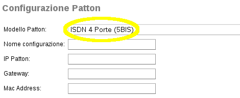
.. image:: ../_static/patton_02.png
            :alt: Configurazione Patton

.. note::   Nel caso non sia in elenco il proprio modello di Patton, utilizzarne un'altro con le stesse funzionalità e comunicare al supporto la mancanza

-  Specificare un nome per la configurazione, l'indirizzo IP del Patton, il gateway della rete e il mac address se si vuole utilizzare il provisioning per configurare il **Patton**

-  Per le porte **fxs** scegliere l'interno SIP collegato alla porta specificata. L'interno SIP deve essere precedentemente creato nell'apposita sezione.

-  Per le porte **fxo** scegliere il numero di telefono associato al numero di fascio autogenerato. L'interfaccia segnala a quale fascio sip verrà abbinata ogni porta, i fasci vengono automaticamente creati e sono disponibili nella sezione :ref:`fasci SIP <fasci_sip_ref_label>`.

-  Per le porte **isdn** scegliere la tipologia delle porte, o punto-punto o punto-multipunto. L'interfaccia segnala a quale fascio sip verrà abbinata ogni porta, i fasci vengono automaticamente creati e sono disponibili nella sezione :ref:`fasci SIP <fasci_sip_ref_label>`.

-  Per le porte **pri** l'interfaccia segnala a quale fascio sip verrà abbinata ogni porta, i fasci vengono automaticamente creati e sono disponibili nella sezione :ref:`fasci SIP <fasci_sip_ref_label>`.

-  Dopo aver cliccato su Salva il modulo propone il link per scaricare la configurazione del Patton a seconda del firmware.
   Se è stato indicato il mac address è possibile applicare la configurazione tramite il provisioning.

Configurazione Patton
---------------------

Gli apparati Patton vengono configurati attraverso un file di configurazione pre-formattato che va importato attraverso l'interfaccia web di amministrazione.

-  Collegare il Patton alla propria rete LAN, inserendo il cavo di rete nell'interfaccia WAN dello stesso.
-  Il Patton di default richiede un ip in DHCP, controllare dai log di |parent_product| qual'è IP che gli è stato assegnato.
-  Collegarsi all'interfaccia web, inserendo tale IP nel browser (username/password di default sono `administrator` e password vuota)
-  Spostarsi nel pannello `Import/Export` -> Import Configuration -> Selezionare il File di Configurazione (vedi paragrafo successivo)
-  Fare il Reload del Patton (**non cliccare su Saving Configuration**)
-  Al Reload assicurarsi che il Patton abbia assunto l'IP corretto (da file di configurazione), inserendo il nuovo IP nel browser
-  Salvare la configurazione con il pannello `Save`

.. _configurazione_mediatrix_ref_label:

Configurazione Mediatrix
========================

Gli apparati **Mediatrix** sono dei gateway SIP, sia isdn che analogici, alternativi ai Patton che possono essere recuperati se |product| va a sostituire un centralino che li utilizzava.

Configurazione tramite Interfaccia Web
--------------------------------------

La configurazione di un gateway Mediatrix per farlo funzionare con |product| è molto semplice da implementare.

Ecco i passi per configurare un gateway con quattro porte isdn come esempio, la configurazione di altri apparati è molto simile.

Presto aggiungeremo in questa pagina anche i files di configurazione per i gateway **Mediatrix** in modo tale che basterà caricare il file da interfaccia per configurare l'apparato.

Può essere utile effettuare il ripristino a factory default dell'apparato e successivamente aggiornare il firmware all'ultima versione.

- Collegarsi all'interfaccia web del Mediatrix http://ip_mediatrix le credenziali di default sono:

::

  IP: 192.168.0.11
  Username: public
  Password:

- Andare su **SIP -> Gateways** e creare un gateway per ogni porta dell'apparato e collegarli alla porta di Uplink. Utilizzare una porta tcp diversa per ogni gateway.

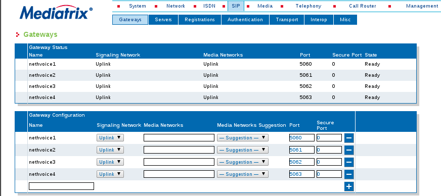

- In **SIP -> Servers** configurare l'ip del |product| alle voci Registrar Host, Proxy Host, Messaging Server Host con la sintassi IP:0 che indica la porta 5060

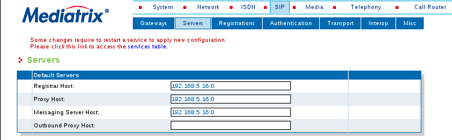

- In **SIP -> Registrations** creare una unità di registrazione per ogni gateway configurato. Consigliamo di utilizzare username a partire da 4000 per poi facilitare la configurazione lato |product|.

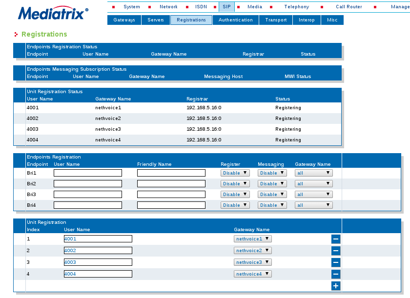

- In **SIP -> Authentication** creare una autenticazione per ogni gateway configurato. Consigliamo di utilizzare username a partire da 4000 con password uguale allo username per poi facilitare la configurazione lato |product|. In fase di creazione disabilitare Validate Realm.

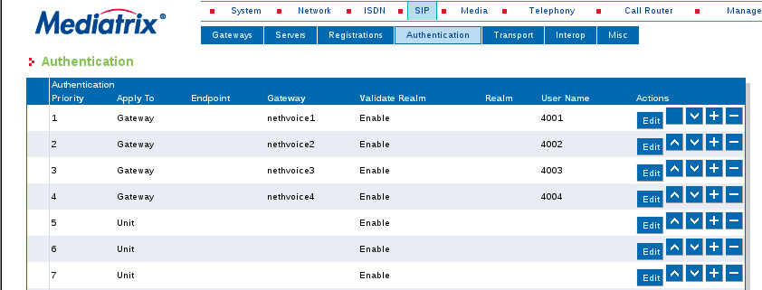
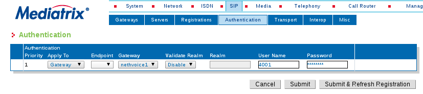

- In **SIP -> Transport** assicurarsi che Add Sip Transport in Registration sia Enable.

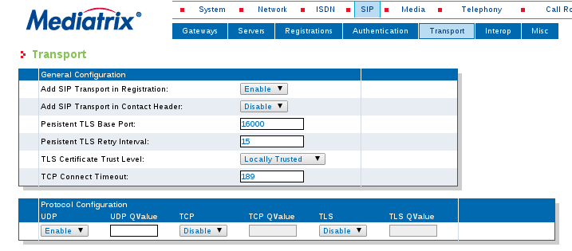

- In **Telephony -> Services** assicurarsi che per ogni Endpoint le tre voci Endpoint Specific siano a no.

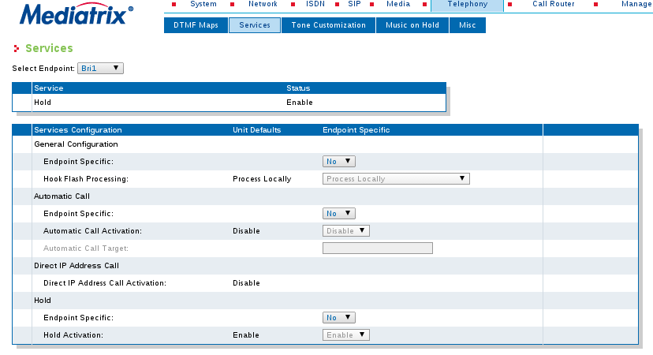

- In **ISDN -> Basic Rate Interface** configurare in caso di porte ISDN il tipo, punto-punto o punto-multipunto, in Connection Type e il massimo numero di canali in Maximum Active Calls, due per isdn ad esempio o una per analogiche.

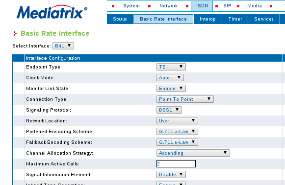

- Creare le rotte in **Call Router -> Route Config** per utilizzare le porte del Mediatrix. Servono una rotta in entrata e una rotta in uscita per ogni porta utilizzata. Le rotte in entrata vanno dalla porta fisica (isdn o analogica) al parte sip, le rotte in uscita l'esatto contrario. Fare attenzione ad associare alla porta la giusta destinazione sip e viceversa.

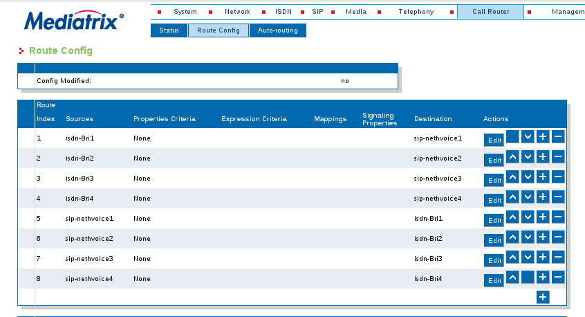

Configurazione Lato |product|
-----------------------------

Per il gateway Mediatrix è necessario configurare :ref:`fascio SIP <fasci_sip_ref_label>` e :ref:`Rotte in Entrata <rotte_in_entrata_ref_label>` per permettere a |product| di interagire con essi.

-  Le :ref:`Rotte in Entrata <rotte_in_entrata_ref_label>` vanno create come al solito sul :ref:`Numero di Selezione Passante <numero_selezione_passante_ref_label>`, che in questo caso sarà il numero della linea ISDN o della linea Analogica.

-  Inoltre è necessario creare un :ref:`fascio SIP <fasci_sip_ref_label>` per ogni linea configurata sul Mediatrix.

I :ref:`fasci SIP <fasci_sip_ref_label>` dovranno avere nome ad esempio 4001, 4002, 4003, 4004 (tanti quanti sono le linee) se il Mediatrix è stato configurato come descritto sopra, e dovranno riportare questa configurazione in `Dettagli Peer`: ::

  canreinvite=no
  nat=no
  context=from-pstn
  host=dynamic
  qualify=yes
  secret=4001
  type=friend
  username=4001
  insecure=very
  port=5060
  dtmfmode=inband

**Per i fasci successivi** (4002, 4003..) è necessario modificare `secret,username e port` di conseguenza, come è stato configurato sul Mediatrix, ad esempio se configurato come indicato sopra il :ref:`fascio SIP <fasci_sip_ref_label>` successivo avrà username e secret 4002 e port 5061.

.. _configurazione_portech_ref_label:

Configurazione Portech
======================

Introduzione
------------

Un Gateway GSM/UMTS è un apparato che, dotato di una o più schede SIM, permette di ricevere o effettuare telefonate passando attraverso la rete GSM/UMTS.

Viene utilizzato insieme al |product| per sfruttare le tariffe telefoniche delle chiamate cellulare verso cellulare che sono generalmente più economiche delle tariffe fisso verso mobile.

Inoltre permette di ricevere le telefonate dirette ad un numero mobile, direttamente su un centralino, molto utilizzato in presenza di RAM aziendali.

.. note::   Tutti gli screenshot utilizzati in questo documento si riferiscono al Portech mv372

.. warning::  Il Gateway GSM/UMTS non è in grado di gestire SIM con PIN attivato. E' necessario da cellulare, disattivare la richiesta del PIN da parte della SIM.

Configurazione Portech con singola SIM
--------------------------------------

Collegata la porta WAN del **Portech mv372**, di default risponderà all'indirizzo http://192.168.0.100, collegarsi all'indirizzo con credenziali:

::

  username: voip
  password: 1234

Modificare l'IP del portech tramite il pannello **WAN Settings** e salvare la configurazione cliccando su *Save Changes*, verrà richiesto il reboot dell'apparato.

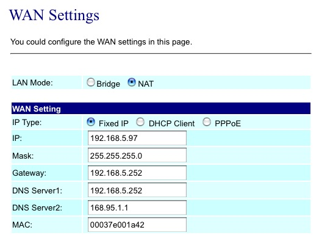

Mobile To LAN Settings
~~~~~~~~~~~~~~~~~~~~~~

Se usiamo il carattere “\*” vengono accettati tutti i numeri.

::

  CID:*
  URL:999

L'url servirà per identificare la rotta in ingresso su |product|

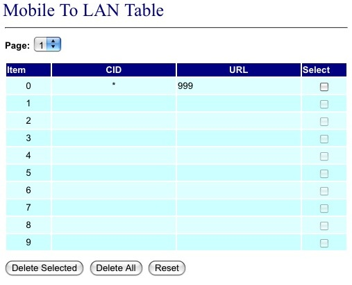

LAN to Mobile Settings
~~~~~~~~~~~~~~~~~~~~~~

Impostare una regola che ci permetta di chiamare tutti i numeri.

::

  URL:* 
  Call Num:#

In questo caso il carattere “#” permette di innoltrare automaticamente la chiamata al numero composto.

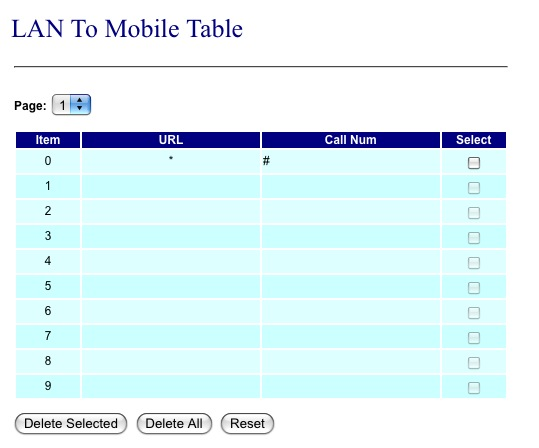

SIP Settings
~~~~~~~~~~~~

Configurare le credenziali per integrare il Gateway GSM/UMTS con |product|

**Mobile 1**

::

  Display Name: SIM 01
  User Name: 3001 (Nome del primo trunk)
  Registration Name: 3001
  Register Password: password1
  Domain Server: ip centralino
  Proxy Server: ip centralino

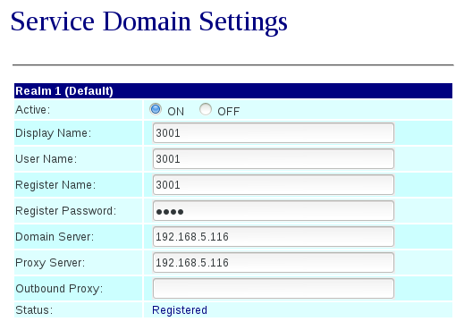

SIP Responses
~~~~~~~~~~~~~

Modificare questa configurazione per restituire al |product| un segnale di servizio non disponibile, nel caso in cui una SIM sia occupata.

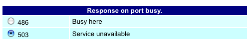

Modificare la configurazione in questo modo, altrimenti **chiamate su cellulari spenti o non raggiungibili, restituiscono il tono di libero** al posto del normale tono di occupato.

::

  OFF 180:Ringing
  ON 183:Session Progress

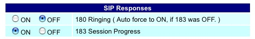

Mobile Status
~~~~~~~~~~~~~

Vengono visualizzati i parametri di registrazione al network GSM/UMTS della sim.

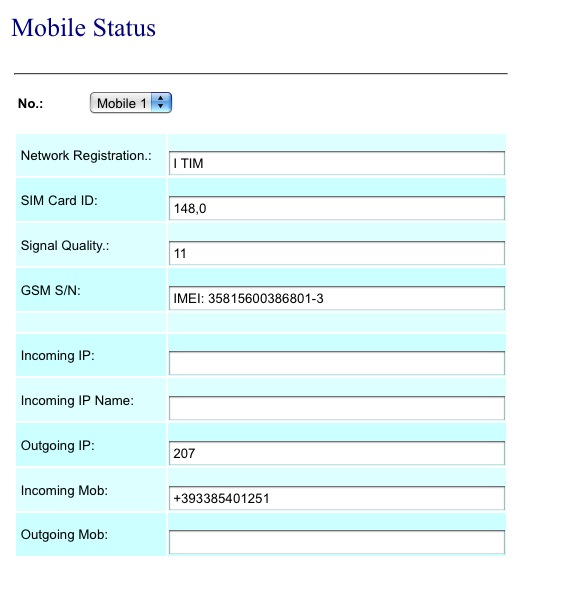

DTMF Setting
~~~~~~~~~~~~

Configurare i toni DTMF cambiando **2833** al posto di inband

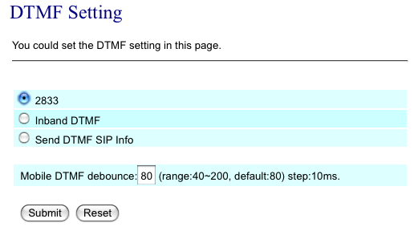

Mobile Setting
~~~~~~~~~~~~~~

Nel pannello Mobile Setting modificare la voce *SIP from* dal default a *Tel/Tel (Not Std)*. Questo permetterà di visualizzare il chiamante e gestire una rotta in base al numero del chiamante.

Configurare |product| 
---------------------

Si dovrà configurare |product| in modo da poter utilizzare in entrata ed in uscita il Gateway GSM/UMTS

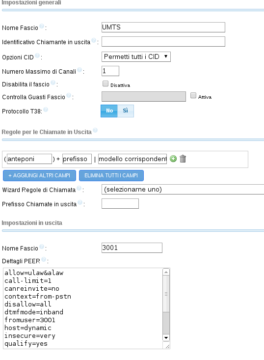

.. warning:: Il Nome Fascio nelle Impostazioni in Uscita deve essere uguale allo username dei Dettagli PEER.

Dettagli PEER Fascio SIP
~~~~~~~~~~~~~~~~~~~~~~~~

::

  allow=ulaw&alaw
  canreinvite=no
  context=from-pstn
  disallow=all
  dtmfmode=rfc2833
  fromuser=3001
  host=dynamic
  insecure=very
  qualify=yes
  regexten=3001
  secret=password1
  type=friend
  username=3001
  port=5060

Nascondere il numero nelle chiamate in uscita
^^^^^^^^^^^^^^^^^^^^^^^^^^^^^^^^^^^^^^^^^^^^^

Per poter nascondere il numero del chiamante, quindi il numero della SIM installata sul portech, è necessario inserire un prefisso su tutte le chiamate in uscita. Quindi nella configurazione del fascio:

::

  Prefisso Chiamate in Uscita: #31#

Nell'esempio è stato inserito *#31* che vale per l'operatore TIM, per altri operatori sarà necessario inserire il codice opportuno.

Configurare Rotta in Ingresso
~~~~~~~~~~~~~~~~~~~~~~~~~~~~~

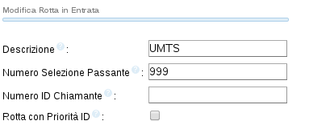

Creare una nuova rotta con

::

  Numero Selezione Passante: 999

Ed impostare la destinazione ad un interno, gruppo, ecc..

Configurare Rotta in Uscita
~~~~~~~~~~~~~~~~~~~~~~~~~~~

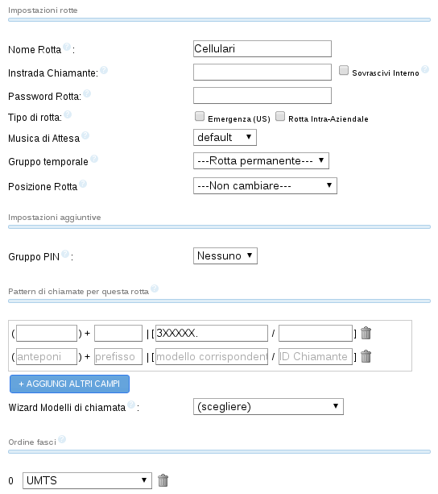

Nome Regola:

::

  Cellulari

Modello Chiamata:

::

  3XXXXX.

Sequenza Fasci:

::

  GSM1

Configurazione doppia SIM
-------------------------
Tale configurazione è possibile con modello **Portech mv372** che contiene il doppio slot per le sim. **Eseguire tutte le procedure descritte al paragrafo precedente**, ed aggiungere le seguenti configurazioni

SIP Settings
~~~~~~~~~~~~

Configurare il **Mobile 2**

**Attenzione:** non il realm2 ma il **Mobile 2** selezionandolo dal menù a tendina in alto.

::

  Display Name: SIM 02
  User Name: 3002 (Nome del secondo trunk)
  Registration Name: 3002
  Register Password: password2
  Domain Server: ip centralino
  Proxy Server: ip centralino

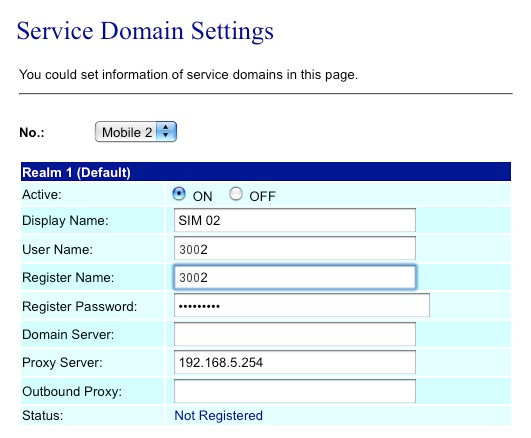

Configurare Secondo Fascio SIP
~~~~~~~~~~~~~~~~~~~~~~~~~~~~~~

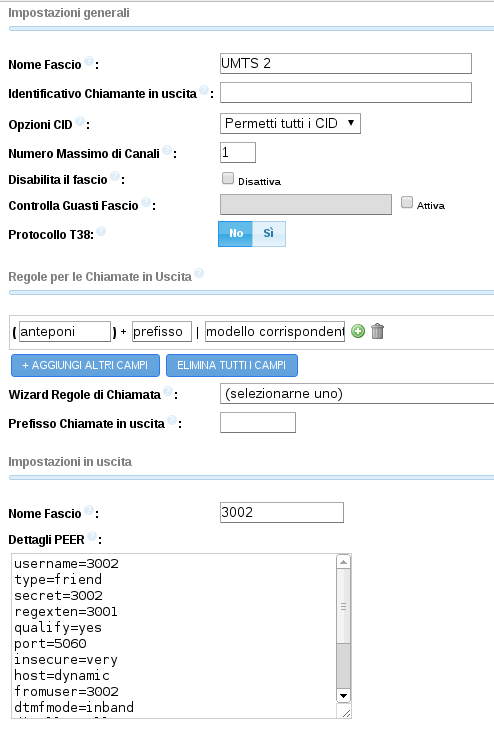

.. warning:: Il Nome Fascio nelle Impostazioni in Uscita deve essere uguale allo username dei Dettagli PEER.

Dettagli PEER Fascio SIP
~~~~~~~~~~~~~~~~~~~~~~~~

::

  allow=ulaw&alaw
  canreinvite=no
  context=from-pstn
  disallow=all
  dtmfmode=rfc2833
  fromuser=3002
  host=dynamic
  insecure=very
  qualify=yes
  regexten=3002
  secret=password2
  type=friend
  username=3002
  port=5060

Portech multi SIM e configurazione delle porte
~~~~~~~~~~~~~~~~~~~~~~~~~~~~~~~~~~~~~~~~~~~~~~

In portech con più di una sim è necessario controllare la configurazione del pannello *Port Setting* sul Portech

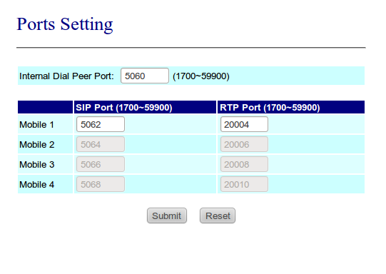

Se la configurazione è quella in figura, sarà necessario configurare il parametro *port* dei fasci **in maniera coerente**:

::

  SIP 3001 --> port=5062
  SIP 3002 --> port=5064
  SIP 3003 --> port=5066
  SIP 3004 --> port=5068

Configurare Rotta in Arrivo
~~~~~~~~~~~~~~~~~~~~~~~~~~~

Modificare la Rotta in Arrivo selezionando come destinazione **un gruppo di chiamata** (se presente un interno) in modo da poter gestire più chiamate contemporaneamente.

Configurare Rotta in Uscita
~~~~~~~~~~~~~~~~~~~~~~~~~~~

Aggiungere alla Selezione Fasci anche **UMTS2** e impostare i fasci
nell'ordine voluto.

Modalità chiamate in arrivo con doppia SIM
~~~~~~~~~~~~~~~~~~~~~~~~~~~~~~~~~~~~~~~~~~

Con la configurazione precedente, *'ogni chiamata in arrivo su una dei due numeri GSM/UMTS viene rediretta da |product| al gruppo configurato*', permettendo quindi di gestire più chiamate entranti contemporaneamente.

In pratica le chiamate di entrambe le SIM saranno ricevute dalla destinazione della Rotta in Entrata con Selezione Passante 999.

Differenziare la destinazione della chiamata per ogni SIM
~~~~~~~~~~~~~~~~~~~~~~~~~~~~~~~~~~~~~~~~~~~~~~~~~~~~~~~~~

Per differenziare le chiamate in entrata sulle due SIM è necessario modificare su Route Mobile to lan Settings creando una nuova regola alla posizione 7 con URL 998.

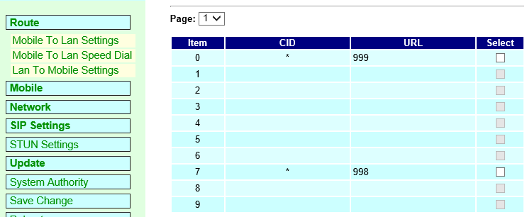

Fatto questo in Mobile Settings si deve configurare il Routing Range della prima scheda da 0 a 5 e per la seconda da 6 a 10.

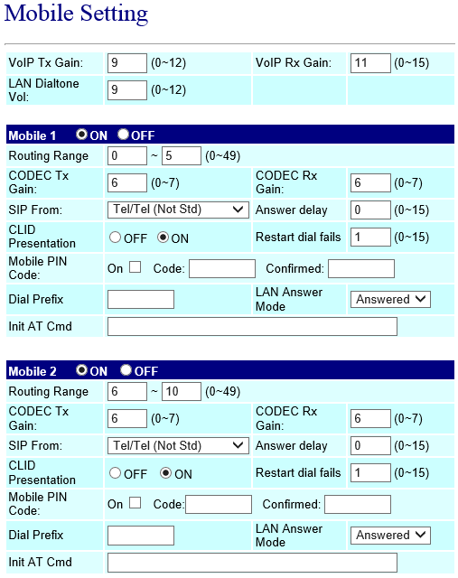

Questa configurazione permetterà di ricevere le chiamate della prima SIM sulla Rotta in Entrata con Selezione Passante 999 e le chiamate della seconda SIM sulla Rotta in Entrata con Selezione Passante 998.

Modalità con tono di linea
~~~~~~~~~~~~~~~~~~~~~~~~~~

In alternativa è possibile modificare la configurazione di *Mobile To LAN Settings* in questo modo:

::

  CID:* 
  URL:*

Le chiamate entranti **riceveranno un tono di linea** e componendo successivamente il numero dell'interno desiderato la chiamata verrà redirezionata sull'interno scelto.

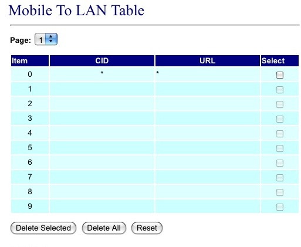

.. _configurazione_schede_interne_ref_label:

Configurazione Schede Interne
=============================

Le schede interne supportate da |product| sono le schede **Digium** per flussi primari.

Spegnere il server ed inserire la scheda poi da riga di comando digitare

 |product_command| hwdetect

Il comando riporta l'elenco delle schede interne supportate rilevate dal |product|. Se la scheda inserita non fosse stata rilevata segnalarlo all'assistenza tecnica.
Il comando che la configura per il |product| è:
 
 |product_command| hwconf

Riavviare il server per caricare correttamente i moduli necessari al funzionamento della scheda.

