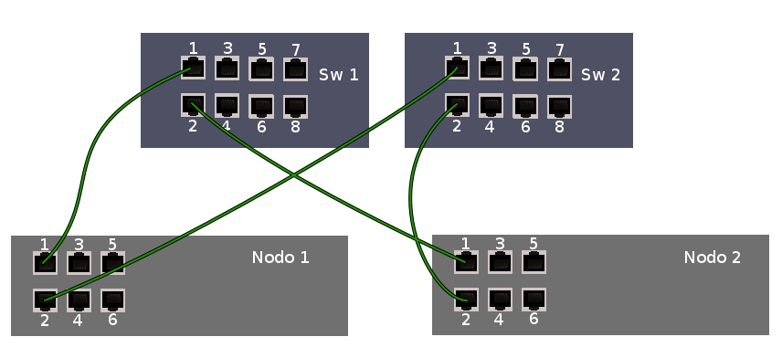

======================
HA (High Availability)
======================

.. note::
   Disponibile solo su |parent_product| 6.

|product| supporta una configurazione in HA limitata ad alcuni scenari specifici.

Il cluster è composto da due nodi in modalità active-passive:
il nodo master (o nodo primario) fornisce il servizio, mentre il nodo slave (o nodo secondario) entra in gioco in caso
di fallimento del nodo master.
Entrambi i nodi condividono uno storage DRBD in modalità active-passive.

Questa configurazione supporta:

* Un IP virtuale collegati sulla rete green
* Servizi clusterizzati che salvano i dati sullo storage condiviso:

  * MySQL
  * Asterisk
  * NethCTI server

Inoltre, al fine di ridurre la complessità del sistema in alta affidabilità si tenga conto delle seguenti limitazioni.

* Gli aggiornamenti automatici sono disabilitati
* E' necessario configurare un server LDAP/Active Directory esterno per l'autenticazione.
* E' necessario configurare un server Jabber esterno per l'integrazione della chat nel CTI
* La rubrica centralizzata non può essere pubblicata su LDAP
* Non è disponibile il gruppo *voicemanagers*: l'accesso ai report e alle pagine di configurazione deve
  essere effettuato obbligatoriamente usando l'utente *admin* la cui password è sincronizzata con quella
  dell'utente *root*
* E' necessario configurare un server DHCP esterno, e configurarlo affinchè i telefoni utilizzino
  come server TFTP l'IP virtuale del cluster

Il demone di monitoraggio (ARDAD) controlla periodicamente lo stato dei servizi.
Dal momento che alcuni servizi (es. asterisk, MySQL) sono in esecuzione solo sul nodo primario,
il demone potrebbe generare degli allarmi sul nodo secondario.
Questi allarmi possono essere silenziati dal Centro Servizi, all'interno del quale
ogni nodo del cluster ha la propria chiave di registrazione (LK).

Requisiti hardware
==================

La procedura prevede l'installazione su due nodi gemelli. Ogni nodo dovrà avere

* un disco o una partizione dedicata allo storage condiviso DRBD (Distributed Replicated Block Device)
* due interfacce di rete per creare un bond con ruolo *green*, entrambe le interfacce
  devono essere collegate agli switch della rete locale

E' necessario possedere due switch all'interno della LAN, per esempio SW1 e SW2.
Creare un bond su ciascun nodo usando due interfacce di rete. 
Ogni nodo deve essere collegato ad entrambi gli switch SW1 e SW2. Usando switch di tipo managed che supportano IF-MIB è possibile far svolgere a questi dispositivi anche il ruolo di fence device. 

Fence device
------------

Ogni nodo dovrà essere collegato ad almeno un fence device già correttamente configurato.

Con il termine *fencing* si intende la disconnessione di un nodo dallo storage condiviso.
Il *fence device* è il dispositivo hardware che consente tale disconnessione usando
il metodo STONITH (Shoot The Other Node In The Head), ovvero togliendo l'alimentazione al nodo guasto.

Molti server possiedono un'interfaccia di gestione preinstallata conosciuta con vari nomi commerciali come
ILO (HP), DRAC (Dell) o BMC (IBM). Tutte queste interfacce rispettano lo standard IPMI e possono
essere utilizzate come dispositivi di fence.

Il dispositivo di fence consigliato in questa guida, consiste in uno switch che supporti il protocollo di management tramite SNMP IF-MIB. I nodi usano IF-MIB::ifAdminStatus per controllare lo stato delle interfacce di rete dello switch, chiudendo le porte con cui l'altro nodo comunica con la rete nel caso in cui sia necessario dargli un fence. L'altro nodo non viene spento, ma non sarà più in grado di comunicare. Per garantire che la  rottura di uno switch non fermi il servizio, si usano due switch, collegati come in figura.

Collegamenti esterni:

* lista dei dispositivi supportati: https://access.redhat.com/articles/28603
* maggiori informazioni sul fencing: http://clusterlabs.org/doc/crm_fencing.html

.. note::
   In questa guida sono riportati solo i comandi per configurare due switch muniti di management IF-MIB come fence device.

.. note::
   Per abilitare e configurare IF-MIB sullo switch, fare riferimento alla guida ed al supporto del produttore.

Installazione
=============

Prima di iniziare:

* collegare i due nodi come previsto e assicurarsi che il nodo secondario sia spento
* assicurarsi che il nome host del nodo primario sia *ns1*. Esempio: ns1.mydomain.com. 
  Scegliere ora anche il dominio, che *non* potrà essere cambiato in seguito

Nodo primario
-------------

Le opzioni del cluster sono salvate all'interno della chiave di configurazione *ha* che deve essere
configurata specularmente su entrambi i nodi.

Eseguire i passi di configurazione come riportati di seguito.

* Configurare il bond sulle interfacce green.

* Configurare l'IP virtuale, ed informare il cluster sugli IP green di entrambi i nodi:

::

 config setprop ha VirtualIP <GREEN_IP_HA>
 config setprop ha NS1 <NS1_GREEN_IP>
 config setprop ha NS2 <NS2_GREEN_IP>

* Applicare le modifiche e avviare i servizi sul nodo primario: 

::

 signal-event nethserver-ha-save

Al termine della configurazione, il nodo primario è pronto ad erogare i servizi.
Per verificare lo stato del cluster, eseguire: ::

 pcs status

Nodo secondario
---------------

* Assicurarsi che l'hostname del nodo secondario sia *ns2* e che il dominio sia lo stesso del nodo primario
* Configurare l'IP virtuale, le opzioni NS1 e NS2, quindi applicare la configurazione:

  ::
 
   signal-event nethserver-ha-save

Configurazione reti aggiuntive
==============================

Per assicurarsi che |product| risponda sempre dall'IP virtuale e che venga utilizzato dai telefoni per il traffico voce, è necessario configurare il source NAT, le reti locali e il bind address. Queste configurazioni non sono necessarie se non ci sono reti locali aggiuntive.

Source NAT
----------

creare un template-custom di shorewall

::

  mkdir -p /etc/e-smith/templates-custom/etc/shorewall/masq

editare il file  `/etc/e-smith/templates-custom/etc/shorewall/masq/15snat`
Per ogni rete locale da cui dovrà essere raggiunto l'IP virtuale (tutte le reti con i telefoni) aggiungere al file creato

<INTERFACCIA>:<RETE LOCALE>/<CIDR> <RETE IP VIRTUALE>/<CIDR> <IP VIRTUALE>

quindi se per esempio volessimo aggiungere le reti 10.10.10.0/24 e 10.2.0.0/16, con l'IP virtuale che è 192.168.1.11 sulla rete 192.168.1.0/24, il nostro file sarà:

::

  # SNAT to Virtual IP
  bond0:10.10.10.0/24 192.168.1.0/24 192.168.1.11
  bond0:10.2.0.0/16 192.168.1.0/24 192.168.1.11

dare i comandi

::

  expand-template /etc/shorewall/masq
  shorewall check

e se il sistema non riporta errori

::

  shorewall restart

*Eseguire queste operazioni su tutti e due i nodi*

Reti locali e reti fidate
-------------------------

Configurare le reti aggiuntive nell'interfaccia di NethServer "Reti fidate". *Eseguire questa operazione su tutti e due i nodi*

Sull'interfaccia di |product|, in `Impostazioni SIP` -> `Configurazione IP` selezionare `IP Statico` o `IP Dinamico` ed aggiungere le reti alle `Reti locali`

Bind address
------------

Sull'interfaccia di |product|, in `Impostazioni SIP` -> `Indirizzo Utilizzato` scrivere l'`IP virtuale`

Sull'interfaccia di |product|, in `Impostazioni IAX` -> `Indirizzo Utilizzato` scrivere l'`IP virtuale`

Passi finali
------------

* Abilitare lo STONITH, digitando su uno qualsiasi dei nodi il seguente comando: 

::

 pcs property set stonith-enabled=true

* Per configurare i fence device, valorizzare correttamente le variabili in questi comandi e lanciarli su uno qualsiasi dei nodi.

  * community=<COMMUNITY>:  nome della community SNMP, si configura sullo switch 
  * ipaddr=<IP_SWITCH_1>: indirizzo IP dello switch 1 o 2
  * login=<USERNAME>: username dell'utente abilitato ad eseguire IF-MIB::ifAdminStatus.
  * password=<PASSWORD>: password dell'utente abilitato ad eseguire IF-MIB::ifAdminStatus.
  * port=N: porta dello switch che verrà chiusa. 
  * snmp_auth_prot=MD5: il protocollo di autenticazione. Deve essere lo stesso configurato sullo switch. Esempio: MD5
  * snmp_priv_passwd=<PASSWORD_PRIV>: password usata per cifrare il traffico. Deve essere la stessa configurata sullo switch
  * snmp_priv_prot=DES: è il protocollo usato per cifrare la comunicazione con lo switch. Per esempio DES. 
  * snmp_sec_level=authPriv: "authPriv" significa che è richiesta l'autenticazione e che lo scambio di messaggi è cifrato con una pre shared key. Non è consigliato usare altri valori.
  * snmp_version=<VERSIONE_SNMP>: versione di snmp da usare. 3 va bene. 
  * pcmk_host_list=<HOST_1>: l'FQDN del nodo (sempre ns1 o ns2) e il dominio. Nel nostro caso, l nome dominio sarà  ``nethserver.org``, quindi  HOST_1 = "ns1.nethserver.org" e HOST_2 "ns2.nethserver.org"

  Per testare di aver correttamente configurato gli switch, verificare che sia possibile chiudere ed aprire le porte con il comando

  ::
  
    fence_ifmib -a <IP_SWITCH_1> -l <USERNAME> -p <PASSWORD> -P <PASSWORD_PRIV> -b MD5 -B DES -d <VERSIONE_SNMP> -c <COMMUNITY> -n<PORTA> -o <off|on|status>

  Per configurare il cluster per utilizzare gli switch come fence device:
  
  ::

    pcs stonith create ns1sw1 fence_ifmib action=off community=<COMMUNITY> ipaddr=<IP_SWITCH_1> login=<USERNAME> passwd=<PASSWORD> port=1 snmp_auth_prot=MD5 snmp_priv_passwd=<PASSWORD_PRIV> snmp_priv_prot=DES snmp_sec_level=authPriv snmp_version=3 pcmk_host_list="<HOST_1>"
    pcs stonith create ns1sw2 fence_ifmib action=off community=fence ipaddr=<IP_SWITCH_2> login=<USERNAME> passwd=<PASSWORD> port=1 snmp_auth_prot=MD5 snmp_priv_passwd=<PASSWORD_PRIV> snmp_priv_prot=DES snmp_sec_level=authPriv snmp_version=3 pcmk_host_list="<HOST_1>"
    pcs stonith create ns2sw1 fence_ifmib action=off community=fence ipaddr=<IP_SWITCH_1> login=<USERNAME> passwd=<PASSWORD> port=2 snmp_auth_prot=MD5 snmp_priv_passwd=<PASSWORD_PRIV> snmp_priv_prot=DES snmp_sec_level=authPriv snmp_version=3 pcmk_host_list="<HOST_2>"
    pcs stonith create ns2sw2 fence_ifmib action=off community=fence ipaddr=<IP_SWITCH_2> login=<USERNAME> passwd=<PASSWORD> port=2 snmp_auth_prot=MD5 snmp_priv_passwd=<PASSWORD_PRIV> snmp_priv_prot=DES snmp_sec_level=authPriv snmp_version=3 pcmk_host_list="<HOST_2>"
    pcs stonith level add 1 <HOST_1> ns1sw1,ns1sw2
    pcs stonith level add 1 <HOST_2> ns2sw1,ns2sw2
    pcs constraint location ns1sw1 prefers <HOST_2>=INFINITY
    pcs constraint location ns1sw2 prefers <HOST_2>=INFINITY
    pcs constraint location ns2sw1 prefers <HOST_1>=INFINITY
    pcs constraint location ns2sw2 prefers <HOST_1>=INFINITY
 
  È inoltre consigliato configurare un'altra scheda di rete con un'altra green o rendere accessibile l'interfaccia di IPMI per facilitare il ripristino del nodo dopo un fence.

* Configurare un indirizzo mail a cui inviare le notifiche in caso di guasto:

::

  pcs resource create MailNotify ocf:heartbeat:MailTo params email="admin@nethserver.org" subject="Cluster notification"

* E' fortemente consigliato cambiare la password di root da interfaccia web su entrambi i nodi. 
  La password di root è infatti utilizzata per impartire ordini ai nodi del cluster.

Guasti e ripristino
===================

Un cluster a due nodi può tollerare solo un guasto alla volta.

.. note::
   Utilizzando i dispositivi di fence di tipo IPMI, il cluster non è in grado di gestire 
   la perdita di alimentazione di un nodo, in quanto il dispositivo di fence è alimentato dal nodo stesso.

   In questo caso è necessario confermare manualmente lo spegnimento del nodo eseguendo questo comando: ::

     pcs stonith confirm <failed_node_name>

Nodi guasti
-----------

Quando un nodo non risponde all'heartbeat, il nodo viene escluso dal cluster.
Tutti i servizi clusterizzati sono disabilitati al boot per evitare problemi in caso di fencing:
un nodo che è stato spento da un evento di fencing, necessita probabilmente di manutenzione prima di rientrare 
nel cluster.

Per inserire nuovamente il nodo nel cluster, eseguire: ::

 pcs cluster start

Fence device irraggiungibili
----------------------------

Il cluster controlla periodicamente lo stato dei dispositivi di fence configurati.
Se un dispositivo non è raggiungibile, verrà considerato in stato fermo (stopped).

Dopo aver ripristinato il dispositivo di fence, informare il cluster sullo stato
di ciascun dispositivo con il seguente comando: ::

  crm_resource --resource <stonith_name> --cleanup --node <node_name>

Ripristino dopo un fence con IF-MIB
-----------------------------------

Nel caso di fencing con IF-MIB il nodo che subisce il fence rimane acceso e se si riaprono le porte dello switch si avrà uno split brain. Quindi sul nodo che ha subito il fence è opportuno fermare il cluster  ::

  pcs cluster stop --force

riaprire poi le porte dello switch  ::

  fence_ifmib -a <IP_SWITCH_1> -l <USERNAME> -p <PASSWORD> -P <PASSWORD_PRIV> -b MD5 -B DES -d <VERSIONE_SNMP> -c <COMMUNITY> -n<PORTA> -o on
  fence_ifmib -a <IP_SWITCH_2> -l <USERNAME> -p <PASSWORD> -P <PASSWORD_PRIV> -b MD5 -B DES -d <VERSIONE_SNMP> -c <COMMUNITY> -n<PORTA> -o on

Split Brain DRBD
----------------
In caso di split brain del DRBD, i dati non vengono più sincronizzati. Può avvenire a causa di un fence fallito.
Lo stato del DRBD del nodo attivo in questa situazione (visibile con cat /proc/drbd) sarà Primary/Unknown e sul nodo non attivo Secondary/Unknown. (invece di Primary/Secondary e Secondary/Primary)
Inoltre con il comando ::

  pcs status

si vedrà il drbd nello stato:
 Master/Slave Set: DRBDDataPrimary [DRBDData]
     Masters: [ ns1.nethserver.org ]
     Stopped: [ ns2.nethserver.org ]

invece di:
 Master/Slave Set: DRBDDataPrimary [DRBDData]
     Masters: [ ns1.nethserver.org ]
     Slaves: [ ns2.nethserver.org ]

Soluzione: 

sul nodo in cui si vogliono tenere tutti i dati dare il comando :: 

  drbdadm invalidate-remote drbd00

sul nodo in cui si desiderano eliminare tutti i dati dare il comando ::

  drbdadm invalidate drbd00

Dare poi su tutti e due i nodi il comando ::

  drbdadm connect drbd00 

verificare poi che il drbd sia di nuovo sincronizzato con ::

  cat /proc/drbd

Disaster recovery
-----------------

In caso di guasto hardware, è possibile reinstallare il nodo è raggiungerlo al cluster.
I servizi clusterizzati saranno automaticamente configurati e i dati verranno sincronizzati fra i nodi.

Seguire questi passi.

1. Ripristinare il backup della configurazione del nodo. Se non si possiede il backup della configurazione,
   riconfigurare il server e assicurarsi di installare il pacchetto ``nethserver-ha``.
2. Eseguire l'evento per unire il nodo al cluster: ::

     signal-event nethserver-ha-save

Backup
======

Il backup deve essere configurato su entrambi i nodi ed eseguito su una condivisione di rete.
Solo il nodo primario effettuerà realmente il backup, il backup del nodo secondario
verrà automaticamente abilitato qualora il nodo primario sia guasto.

In caso di guasto di entrambi i nodi, reinstallare il nodo primario,
ripristinare il backup della configurazione e avviare il cluster: ::

 signal-event nethserver-ha-save

Infine ripristinare il backup dei date e, al termine, riavviare il sistema.

