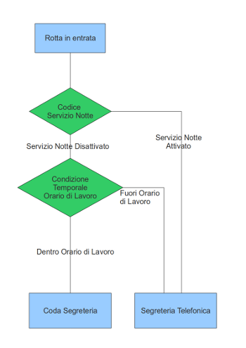

================
Routing Chiamata
================

.. _controllo_flusso_chiamata_ref_label:

Controllo Flusso Chiamata
=========================

Descrizione
-----------

Il modulo Controllo Flusso Chiamata offre una alternativa al modulo :ref:`Servizio Notte <servizio_notte_ref_label>` per cambiare il percorso della chiamata in entrata.

Anche in questo caso componendo dei codici via telefono senza accedere alla configurazione web del |product|, è possibile modificare il normale flusso della chiamata.

La differenza tra il modulo Controllo Flusso Chiamata e il modulo :ref:`Servizio Notte <servizio_notte_ref_label>` è che mentre il :ref:`Servizio Notte <servizio_notte_ref_label>` deve essere indicato sulle :ref:`Rotta in Entrata <rotte_in_entrata_ref_label>` il Controllo Flusso Chiamata va inserito direttamente nel flusso della chiamata come un qualsiasi altro modulo.

Una volta configurato un Controllo Flusso Chiamata viene creato un codice, \*28X dove X è l'indice del codice, che se chiamato da un interno cambia la modalità del Controllo Flusso Chiamata da Normale (Verde/BLF Spento) ad Alternativa (Rosso/BLF Acceso) o viceversa.

Integrazione BLF Telefoni
-------------------------

E' possibile integrare il Controllo Flusso Chiamata con le luci dei telefoni che supportano il BLF (es. Sangoma, Yealink, Snom), semplicemente impostando come extension da monitorare sul telefono il codice del Controllo Flusso Chiamata ( \*28X ). In questa maniera, la luce accesa informa che il Controllo Flusso Chiamata configurato in quel pulsante è in modalità **Alternativa**, la luce spenta significa che è in modalità **Normale**. Premendo il pulsante relativo a questo interno, si potrà attivare/disattivare il servizio.

Configurazione
--------------

Indice del codice per abilitare/disabilitare Controllo di Flusso
~~~~~~~~~~~~~~~~~~~~~~~~~~~~~~~~~~~~~~~~~~~~~~~~~~~~~~~~~~~~~~~~

E' prevista la creazione di un massimo di 10 Controlli Flusso Chiamata, scegliere qui il codice di quello da configurare.

Descrizione
~~~~~~~~~~~

Descrizione per individuare velocemente il Controllo Flusso Chiamata.

Modo Corrente
~~~~~~~~~~~~~

Stato iniziale se si sta configurando un nuovo Controllo Flusso Chiamata, o modifica dello stato attuale se ne sta configurando uno già creato. Le modalità sono Normale (Verde/BLF Spento) e Alternativa (Rosso/BLF Acceso).

Registrazioni per Modalità Normale
~~~~~~~~~~~~~~~~~~~~~~~~~~~~~~~~~~

Messaggio audio da riprodurre al chiamante in caso di Modalità Normale, vengono proposte tutte le :ref:`Registrazioni di Sistema <registrazioni_di_sistema_ref_label>` già caricate.

Registrazione per Modalità Alternativa
~~~~~~~~~~~~~~~~~~~~~~~~~~~~~~~~~~~~~~

Messaggio audio da riprodurre al chiamante in caso di Modalità Alternativa, vengono proposte tutte le :ref:`Registrazioni di Sistema <registrazioni_di_sistema_ref_label>` già caricate.

Password Opzionale
~~~~~~~~~~~~~~~~~~

Il |product| può richiedere di inserire una password quando si tenta di utilizzare il codice di attivazione/disattivazione. Inserire qui una password numerica.

Flusso Normale (Verde/BLF Spento)
~~~~~~~~~~~~~~~~~~~~~~~~~~~~~~~~~

Destinazione della chiamata se la modalità del Flusso Chiamata è Normale (Verde/BLF Spento).

Flusso Alternativo (Rosso/BLF Acceso)
~~~~~~~~~~~~~~~~~~~~~~~~~~~~~~~~~~~~~

Destinazione della chiamata se la modalità del Flusso Chiamata è Alternativa (Rosso/BLF Acceso).

.. _fasci_virtuali_ref_label:

Fasci Virtuali
==============

Descrizione
-----------

I Fasci Virtuali di |product| hanno la funzione di usare le sorgenti telefoniche collegate al centralino tramite i :ref:`Fasci <fasci_ref_label>` con modalità più "intelligenti".

E' possibile infatti bilanciare le chiamate in uscita tra i fasci selezionati, in modo tale che il |product| controlli prima di utilizzare un fascio quale tra quelli inseriti nel Fascio Virtuale è stato utilizzato per un minor numero di secondi.

Questa opzione non porta ad un bilanciamento immediato delle chiamate, non sarebbe materialmente possibile se non troncando le chiamate e facendole ripartire su altro canale, ma in un periodo più lungo porta ad un utilizzo pressoché equilibrato delle risorse.

Altra opzione dei Fasci Virtuali è la possibilità di poter utilizzare di un fascio configurato sul |product| solo la parte di traffico prepagato che viene offerta dall'operatore, cosa che aiuta a ridurre i costi delle telefonate.

Se indicato l'ammontare in minuti del prepagato, che può essere settimanale, mensile o annuale, il fascio verrà utilizzato solo per i minuti indicati e poi il |product| utilizzerà le altre fonti in elenco.

Configurazione
--------------

Bilanciato
~~~~~~~~~~

Se abilitato i fasci indicati nella configurazione successiva verranno utilizzati in maniera bilanciata, cioè l'ordine di utilizzo sarà stabilito dal |product| per ogni telefonata da effettuare con questo Fascio Virtuale partendo dal fascio meno utilizzato fino ad arrivare a quello più utilizzato.

Nome Fascio Virtuale
~~~~~~~~~~~~~~~~~~~~

Nome di questo Fascio Virtuale, sarà quello che poi si troverà nelle :ref:`Rotte in Uscita <rotte_in_uscita_ref_label>`.

Descrizione Fascio Virtuale
~~~~~~~~~~~~~~~~~~~~~~~~~~~

Descrizione di questo Fascio Virtuale.

Posizione
~~~~~~~~~

Posizione del fascio "reale" all'interno del Fascio Virtuale. E' indicativa se non è abilitato il bilanciamento.

Fascio
~~~~~~

Fascio "reale" da inserire nel Fascio Virtuale, vengono elencati i :ref:`Fasci <fasci_ref_label>` già configurati.

Minuti Prepagati
~~~~~~~~~~~~~~~~

Se si vuole utilizzare solo la parte prepagata del traffico del fascio indicare qui l'ammontare in minuti.

Periodo Prepagato
~~~~~~~~~~~~~~~~~

Periodo per cui è valido il prepagato. Da riferirsi al contratto con l'operatore telefonico.

Cancella
~~~~~~~~

Cancella una configurazione errata.

.. _rotte_in_entrata_ref_label:

Rotte Entrata
=============

Descrizione
-----------

Le Rotte in Entrata sono il primo elemento nella gestione delle chiamate in entrata in |product|.

Servono a stabilire qual'è il primo modulo del |product| da interessare all'arrivo della chiamata e a fare discriminazioni a seconda del chiamante e/o del chiamato e della tipologia di chiamata voce o fax.

Le Rotte in Entrata non vengono valutate dal |product| in base all'ordine ma in base alla probabilità. La rotta con più probabilità di centrare il numero chiamante ed il numero chiamato viene utilizzata.

Per attivare questo controllo però, è necessario che almeno una Rotta in Entrata abbia un numero chiamante o un numero chiamato ben determinati, che quindi forniscano una base per il calcolo delle probabilità.

Le Selezioni Passanti dirette agli interni(numeri in entrata che fanno squillare subito un interno) possono essere create anche nella configurazione interni, vedi `qui <interni_sip_ref_label>`.

Configurazione
--------------

Descrizione
~~~~~~~~~~~

Descrizione per individuare la Rotta.

.. _numero_selezione_passante_ref_label:

Numero Selezione Passante
~~~~~~~~~~~~~~~~~~~~~~~~~

Inserire il Numero di Selezione Passante con cui la chiamata arriva al |product|.

Lasciando il campo vuoto è possibile far corrispondere questa Rotta in Entrata a tutte le chiamate in arrivo, opzione sconsigliata quando è possibile essere più specifici.

E' anche possibile utilizzare i :ref:`pattern <pattern_ref_label>` di Asterisk per avere delle regole con più corrispondenze. In questo caso **è necessario** premettere al numero \_ (underscore), ad esempio \_0721X. che notifica a |product| che si farà uso di pattern.

Numero ID Chiamante
~~~~~~~~~~~~~~~~~~~

Inserire il Numero Identificativo del Chiamante della chiamata in entrata.

Lasciando questo campo vuoto ci si riferisce a tutti gli ID Chiamanti.

E' anche possibile utilizzare per il Numero Identificativo del Chiamante i :ref:`pattern <pattern_ref_label>` di Asterisk per avere delle regole con più corrispondenze.

Oltre ad una numerazione è possibile inserire delle stringhe per i casi speciali, come ad esempio la chiamata anonima. Le stringhe variano da operatore ad operatore e bisogna verificare effettivamente come arriva la chiamata al |product|, ad esempio Anonymous o Unknown.

Rotta con Priorità ID
~~~~~~~~~~~~~~~~~~~~~

Spuntando questa opzione in una rotta senza Selezione Passante ma con Numero ID Chiamante, si crea una priorità per questo ID chiamante forzando il |product| ad usare questa Rotta anche se la chiamata sarebbe in grado di entrare in un'altra rotta. Una Rotta In Entrata con Selezione Passante e con lo stesso ID Chiamante avrà però la priorità.

Opzioni
-------

Alert Info
~~~~~~~~~~

Selezionando un Alert Info è possibile modificare la suoneria dei telefoni ip che suoneranno per una chiamata che è entrata in questa Rotta in vedi anche :ref:`qui <suoneria_differenziata_ref_label>`.

Prefisso ID Chiamante
~~~~~~~~~~~~~~~~~~~~~

Inserendo questo campo si aggiunge un prefisso all'id chiamante che verrà poi visualizzato sui telefoni che riceveranno la chiamata, serve a individuare che il telefono sta suonando per una chiamata entrata in questa Rotta in Entrata.

Ad esempio se si inserisce "Commerciale:" e si riceve una chiamata da un numero abbinato dal |product| ad un contatto in rubrica , sul display del telefono che squilla verrà visualizzato "Commerciale:Nome".

Musica di Attesa
~~~~~~~~~~~~~~~~

Impostare la classe di Musica di Attesa che verrà utilizzata per le chiamate che verranno da questa Rotta in Entrata.

Segnale di SQUILLO
~~~~~~~~~~~~~~~~~~

Alcuni gestori telefonici richiedono un segnale di squillo prima di attivare la chiamata, spuntando questa opzione il |product| lo attiverà. Serve per configurazioni ormai superate.

Pausa prima della risposta
~~~~~~~~~~~~~~~~~~~~~~~~~~

Secondi di attesa prima che il |product| processi la chiamata entrata in questa Rotta. Serve in configurazioni dove ci sono apparecchi in parallelo sulle stesse linee esterne, ad esempio un fax.

Privacy
-------

Gestione Privacy
~~~~~~~~~~~~~~~~

Attivando la Gestione Privacy se la chiamata non ha un ID Chiamante valido verrà chiesto dal |product| di inserire il proprio numero che poi verrà forzato nella Rotta in Entrata per visualizzarlo sui telefoni.
Se un interno ha il :ref:`controllo chiamata <interni_sip_ref_label>` attivo al chiamante verrà chiesto di pronunciare anche il suo nome e la registrazione poi sarà proposta prima di collegare la chiamata.

Lingua
------

Permette la scelta della lingua in questa Rotta, questo comporta tra l'altro l'utilizzo dei messaggi di sistema del |product| della lingua selezionata. Il default è italiano.

Registrazione Chiamata
----------------------

Configura le opzioni di registrazione per le chiamate di questa rotta.

*  **Permetti** considera le normali opzioni di registrazione.
*  **Registra alla risposta** inizia la registrazione quando sarebbe permesso ignorando tutte le impostazioni che dicono il contrario.
*  **Registra Subito** partirà registrando subito la chiamata considerando squillo, annunci, musica di attesa ecc.
*  **Mai** non consentirà la registrazione indipendentemente dalle impostazioni successive.

Gestione Fax
------------

Protocollo T38
~~~~~~~~~~~~~~

Attiva la predisposizione a ricevere fax con protocollo T38.

Riconoscimento Fax
~~~~~~~~~~~~~~~~~~

Attiva il Riconoscimento Fax nel caso si tratti di una linea mista voce e fax.

*  **No** la chiamata andrà direttamente alla destinazione specificata in Imposta Destinazione.
*  **Si** il |product| tenterà di determinare il tipo di chiamata, rispondendo alla chiamata e per un tempo indicato in Pausa dopo la Risposta restando in ascolto mentre al chiamante verrà inviato il suono di squillo. Se viene riconosciuta come fax la chiamata viene inoltrata alla Destinazione Fax, altrimenti alla destinazione specificata in Imposta Destinazione.

Pausa dopo la Risposta
~~~~~~~~~~~~~~~~~~~~~~

Tempo in secondi che il |product| usa per riconoscere il tipo di chiamata.

Destinazione Fax
~~~~~~~~~~~~~~~~

Destinazione della chiamata se riconosciuta come fax.

Servizio Notte
--------------

Selezione Servizio Notte
~~~~~~~~~~~~~~~~~~~~~~~~

Selezionare il :ref:`Servizio Notte <servizio_notte_ref_label>` per questa Rotta in Entrata. Utilizzando i codici di attivazione/disattivazione del :ref:`Servizio Notte <servizio_notte_ref_label>` selezionato la chiamata che entra in questa rotta verrà inoltrata o al servizio notte se attivo o alla destinazione selezionata.

Imposta Destinazione
--------------------

La destinazione della chiamata se gestita da questa Rotta in Entrata.

.. _rotte_in_uscita_ref_label:

Rotte Uscita
============

Descrizione
-----------

Le Rotte in Uscita gestiscono le chiamate uscenti su |product|.

Nelle Rotte in Uscita è possibile discriminare con che sorgente telefonica tentare la chiamata, ordinare la priorità di utilizzo delle sorgenti telefoniche, stabilire i modelli di chiamata permessi, gestire i prefissi in uscita o anteporre delle cifre alla chiamata effettuata, consentire o vietare a particolari interni o gruppi di interni l'utilizzo di una Rotta in uscita.

Vengono valutate una per una in ordine dalla prima riga nell'elenco di destra, se una Rotta in Uscita soddisfa le condizioni della chiamata viene utilizzata e il percorso della chiamata

Configurazione
--------------

Nome Rotta
~~~~~~~~~~

Nome descrittivo della Rotta in Uscita, è consigliato usare un nome che descriva il tipo di chiamata che la Rotta permette/vieta.

Instrada Chiamante
~~~~~~~~~~~~~~~~~~

Inserire l'ID chiamante per che chiamate che utilizzeranno questa Rotta in Uscita.

Questa opzione avrà la precedenza su tutte le configurazioni effettuate tranne:

*  ID Chiamante di Emergenza configurato sull':ref:`interno <interni_sip_ref_label>` se questa Rotta in Uscita viene indicata come rotta di emergenza.
*  ID Chiamante del :ref:`Fascio <fasci_ref_label>` se il Fascio è configurato per forzare il CID.
*  ID Chiamante delle chiamante inoltrate (CF, Seguimi, Gruppi, etc.).
*  ID Chiamante sull':ref:`interno <interni_sip_ref_label>` se selezionato.

Selezionando Sovrascrivi Interno, l'ID Chiamante dell'interno sarà ignorato e sostituito con questo, tranne quando si tratta di rotte di emergenza.

Password Rotta
~~~~~~~~~~~~~~

E' possibile richiedere una password prima di consentire l'utilizzo di questa Rotta in Uscita. La password deve essere numerica.

Tipo di rotta
~~~~~~~~~~~~~

E' possibile definire se questa Rotta viene utilizzata per chiamate di emergenza o per chiamate intra-aziendali.

*  Attivando l'opzione Emergenza il |product| utilizzerà come ID Chiamante l'ID di emergenza configurato nell':ref:`interno <interni_sip_ref_label>`, attivare questa opzione se la rotta viene utilizzata esclusivamente per chiamate di emergenza.
*  Attivando l'opzione Rotta Intra-Aziendale l'ID Chiamante non verrà sovrascritto ne modificato, preservando l'ID Chiamante dell'interno. Abilitare questa opzione se si utilizza questa rotta esclusivamente per chiamate intra-aziendali.

Musica di Attesa
~~~~~~~~~~~~~~~~

La :ref:`Musica di Attesa <musiche_di_attesa_ref_label>` che verrà utilizzata per chiamate che escono da questa Rotta è configurabile, scegliendo la categoria desiderata.

Gruppo temporale
~~~~~~~~~~~~~~~~

Se questa Rotta in Uscita deve essere disponibile solo in un determinato lasso di tempo, è possibile selezionare un determinato :ref:`Gruppo Temporale <Gruppi_Temporali_ref_label>` precedentemente configurato.
La Rotta sarà quindi ignorata al di fuori dei tempi specificati nel :ref:`Gruppo Temporale <gruppi_temporali_ref_label>`. Lasciare a *Rotta Permanente* per avere sempre disponibile questa Rotta In Uscita.

Posizione Rotta
~~~~~~~~~~~~~~~

La posizione della Rotta in Uscita è determinante, in quanto come detto il |product|, valuta le rotte in ordine, è possibile quindi modificarne la posizione selezionandola in questo menù, oppure usando il drag&drop tra le rotte nel menù verde a destra.

Impostazioni aggiuntive
-----------------------

Gruppo PIN
~~~~~~~~~~

Selezionando un :ref:`Gruppo PIN <gruppi_pin_ref_label>` e lasciando vuota la Password Rotta, il |product| valuterà l'accesso alla Rotta in Uscita in base all'inserimento di uno dei pin del gruppo.

Pattern chiamate
----------------

Pattern di chiamate per questa rotta
~~~~~~~~~~~~~~~~~~~~~~~~~~~~~~~~~~~~

Inserire il modello di chiamata per cui questa rotta deve essere valida, può essere d'aiuto il wizard sotto.

C'è la possibilità di utilizzare più righe contemporaneamente per raggruppare il medesimo comportamento su più modelli di chiamata.

*  Anteponi: inserire le cifre che il |product| aggiungerà al numero chiamato prima di effettuare la chiamata. Non è possibile per ovvie ragioni usare i :ref:`pattern di Asterisk <pattern_ref_label>` in questo campo.
*  Prefisso: inserire le cifre che devono essere tolte dal |product| a partire dall'inizio del numero chiamato prima di effettuare la chiamata. Non è possibile per ovvie ragioni usare i :ref:`pattern di Asterisk <pattern_ref_label>` in questo campo.
*  Modello Corrispondente: inserire il modello di chiamata in uscita che la Rotta in Uscita deve considerare. E' possibile utilizzare i :ref:`pattern di Asterisk <pattern_ref_label>` in questo campo.
*  ID Chiamante: inserire l'ID Chiamante per cui deve essere permesso il modello di chiamata, serve a limitare il modello corrispondente ad uno o più interni ad esempio. E' possibile utilizzare i :ref:`pattern di Asterisk <pattern_ref_label>` in questo campo.

Qualche esempio di modello di chiamata:

*  [01378]X. vale per tutte le chiamate
*  00XX. vale per le chiamate internazionali
*  3XXXXX. vale per le chiamate ai cellulari

Wizard Modelli di chiamata
~~~~~~~~~~~~~~~~~~~~~~~~~~

Con il menù del Wizard Modelli di chiamata è possibile caricare uno tra i tipi di chiamata che si trovano in elenco, con o senza prefisso d'uscita.

Ordine fasci
------------

In questa parte si deve configurare l'ordine con cui la Rotta in Uscita tenterà di usare i :ref:`Fasci <fasci_ref_label>` configurati sul |product| per effettuare la chiamata in uscita. Il |product| scalerà da un fascio all'altro seguendo l'ordine di inserimento se il primo fascio risulterà occupato in altre conversazioni, non disponibile o non registrato.

.. _servizio_notte_ref_label:

Servizio Notte
==============

Descrizione
-----------

Il Servizio Notte e' uno strumento molto utile, perché permette di cambiare il percorso delle chiamate in entrata direttamente componendo alcuni codici via telefono, senza accedere alla configurazione web del |product|. Per essere utilizzato in questo modo, il servizio notte dovrà essere impostato nella :ref:`Rotta in Entrata <rotte_in_entrata_ref_label>`.

Un possibile esempio di utilizzo può essere la necessità di chiudere in anticipo l'ufficio rispetto all'orario di chiusura, componendo i codici del Servizio Notte verrà attivata ad esempio la segreteria telefonica o l'IVR notturno o l'inoltro di chiamata, dato che il Servizio Notte avrà priorità sul resto delle condizioni impostate sulla :ref:`Rotta in Entrata <rotte_in_entrata_ref_label>`.

Il Servizio Notte è configurabile anche da |product_cti|, dove è possibile bypassare la configurazione del |product| per personalizzarne temporaneamente il funzionamento.

Configurazione
--------------

La configurazione mostra quale delle due impostazioni, quella lato |product| o quella lato |product_cti|, è al momento quella in vigore.
E' possibile cambiare questa configurazione semplicemente selezionando la modalità desiderata e facendo salva.
Lato centralino non è ovviamente modificabile la configurazione del Servizio Notte fatta dal |product_cti|, è possibile solo escluderla e riattivare quella lato |product|.
Se è attiva la configurazione fatta lato |product_cti| viene mostrato:

* il tipo di configurazione scelta in Azione, con i dettagli della configurazione successivamente
* quale utente ha effettuato la configurazione e quando

Per la configurazione lato |product| invece:

Nome Servizio Notte
~~~~~~~~~~~~~~~~~~~

Inserire un nome per facilitare il riconoscimento di questa opzione all'interno delle destinazioni.

Attivazione Manuale
~~~~~~~~~~~~~~~~~~~

Questa impostazioni valgono solo per l'attivazione manuale, se il servizio notte è configurato come destinazione non vengono prese in considerazione. E' possibile definire un intervallo temporale su cui attivare il servizio, o forzare l'attivazione o disattivazione. Tramite i codici telefonici e' possibile solo la attivazione o disattivazione, non e' possibile specificare un intervallo.  
I valori possibili sono:

*  **Attivo**: il Servizio Notte manuale è attivo per le :ref:`Rotta in Entrata <rotte_in_entrata_ref_label>` in cui è configurato.
*  **Non Attivo**: il Servizio Notte manuale non è attivo.
*  **Specifica Periodo**: il Servizio Notte manuale è attivo per le rotte in cui è configurato nell'intervallo specificato.

Destinazione Servizio Notte
~~~~~~~~~~~~~~~~~~~~~~~~~~~

E' possibile specificare qualsiasi destinazione per il servizio notte, alcune configurazioni comuni sono:

*  Configurare una segreteria telefonica: impostando un :ref:`Annuncio <annunci_ref_label>` (che al suo interno è legato ad una :ref:`casella vocale <casella_vocale_ref_label>`).
*  Configurare un inoltro ad un cellulare o numero fisso esterno: impostando un :ref:`Gruppo di Chiamata <gruppi_di_chiamata_ref_label>` contenente il numero seguito dal carattere #

Codici Servizio Notte
---------------------

Ogni Servizio Notte mette a disposizione tre codici, per poterlo gestire da telefono:

*  8XX0: permette di testare il Servizio Notte
*  8XX1: permette di configurare da telefono il Servizio Notte
*  8XX2: permette di attivare/disattivare il Servizio Notte.

dove XX è il progressivo assegnato a questo Servizio Notte.

Integrazione BLF Telefoni
-------------------------

E' possibile integrare il Servizio Notte con le luci dei telefoni che supportano il BLF (es. Sangoma, yealink, Snom), semplicemente impostando come extension da monitorare sul telefono l'interno relativo alla attivazione/disattivazione del servizio notte ( 8XX2). In questa maniera, la luce accesa informa che il Servizio Notte manuale configurato in quel pulsante è attivo, la luce spenta significa che è non attivo. Premendo il pulsante relativo a questo interno, si potrà attivare/disattivare il servizio, ascoltando un messaggio di conferma.

.. _condizioni_temporali_ref_label:

Condizioni Temporali
====================

Descrizione
-----------

Le Condizioni Temporali permettono di definire dei comportamenti differenti del |product| in base a data, giorno della settimana, giorno del mese, mese e ora in cui arriva la telefonata.

La Condizione Temporale si basa su un raggruppamento di tempo configurato in un :ref:`Gruppo Temporale <gruppi_temporali_ref_label>`.

E' necessario quindi, aver già configurato un :ref:`Gruppo Temporale <gruppi_temporali_ref_label>` per poter creare una Condizione Temporale.

Le destinazioni possibili in caso che la Condizione temporale sia rispettata o meno sono tutti i moduli già configurati nel |product|.

Una volta definita una Condizione Temporale questa sarà disponibile per essere utilizzata come Destinazione nei vari moduli del |product|.

Un utilizzo tipico è per definire e automatizzare gli orari di apertura e chiusura, facendo sì che durante gli orari di apertura la chiamata venga dirottata al posto operatore, e durante gli orari di chiusura venga attivato automaticamente il servizio notte o una segreteria. Una volta definita la Condizione Temporale, questa va attivata come destinazione della :ref:`Rotta in Entrata <rotte_in_entrata_ref_label>` relativa al numero su cui la vogliamo attivare.

Configurazione
--------------

Nome Condizione Temporale
~~~~~~~~~~~~~~~~~~~~~~~~~

Inserire una descrizione che serva per individuare la Condizione Temporale.

Genera Hint BLF
~~~~~~~~~~~~~~~

|product| può generare un Hint BLF per visualizzare, ad esempio su un telefono con un pannello lampade, lo stato della Condizione Temporale, e se abilitato il codice per Ignorare, si può utilizzare il tasto per attivare o disattivare la condizione temporale.

Abilita Codice per Ignorare
~~~~~~~~~~~~~~~~~~~~~~~~~~~

E' possibile abilitare un codice, fornito tra parentesi, che permette chiamandolo da un interno di attivare e disattivare la Condizione Temporale a mano, forzando la destinazione se la condizione non esiste anche in orari contenuti nel :ref:`Gruppo Temporale <gruppi_temporali_ref_label>`.

Gruppo Temporale
~~~~~~~~~~~~~~~~

Vengono proposti tutti i :ref:`Gruppi Temporale <gruppi_temporali_ref_label>` configurati sul |product|. Selezionarne uno.

Destinazione se la condizione esiste
~~~~~~~~~~~~~~~~~~~~~~~~~~~~~~~~~~~~

Destinazione della chiamata se questa arriva in un lasso di tempo **compreso** nel :ref:`Gruppo Temporale <gruppi_temporali_ref_label>`.

Destinazione se la condizione non esiste
~~~~~~~~~~~~~~~~~~~~~~~~~~~~~~~~~~~~~~~~

Destinazione della chiamata se questa arriva in un lasso di tempo **non compreso** nel :ref:`Gruppo Temporale <gruppi_temporali_ref_label>`.

.. _gruppi_temporali_ref_label:

Gruppi Temporali
================

I Gruppi temporali servono a dividere il tempo e a crearne dei raggruppamenti, per poi essere utilizzati nelle :ref:`rotte in uscita <rotte_in_uscita_ref_label>` e nelle :ref:`condizioni temporali <condizioni_temporali_ref_label>`.

Le suddivisioni di tempo possono avvenire in diverse modalità, per orario, per giorno della settimana, per giorno del mese, per mese.

L'inserimento di un nuovo Gruppo Temporale è una procedura molto semplice, serve una descrizione per riconoscerlo e poi si può configurare la prima fascia temporale.

Per avere la possibilità di aggiungerne altre nello stesso Gruppo Temporale basta cliccare su Salva e rientrare sullo stesso.

.. _selezioni_passanti_zap_ref_label:

Selezioni Passanti Zap
======================

Descrizione
-----------

Quando, ad esempio, sul |product| sono installate delle schede interne per collegare delle linee analogiche e c'è la necessita di creare una selezione passante, è necessario creare una Selezione Passante Canale Zap in questo modulo.

Creando una Selezione Passante infatti si mappa la chiamata entrante nella linea collegata alla scheda interna con il numero prescelto.

Una volta creata la Selezione Passante Zap basta poi nelle :ref:`Rotte in Entrata <rotte_in_entrata_ref_label>` utilizzarla per gestire la chiamata.

E' possibile associare la stessa Selezione Passante a molteplici canali zap, questo se ci sono linee in ricerca passante ad esempio.

Configurazione
--------------

Canale
~~~~~~

Inserire il numero di canale zap da mappare su una Selezione Passante, ad esempio se è stata collegata una scheda pci per linee analogiche ogni porta corrisponderà ad un canale.

Descrizione
~~~~~~~~~~~

Una descrizione utile per riconoscere questa Selezione Passante.

Selezione Passante
~~~~~~~~~~~~~~~~~~

La Selezione Passante che questo canale rappresenta, la chiamata in arrivo su questo canale sarà trattata come se venisse da questa Selezione Passante e ne sarà possibile la gestione tramite le :ref:`Rotte in Entrata <rotte_in_entrata_ref_label>`.

